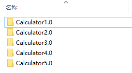
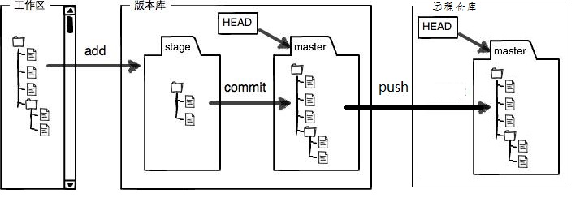
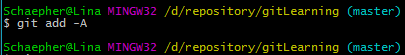
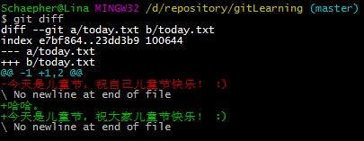
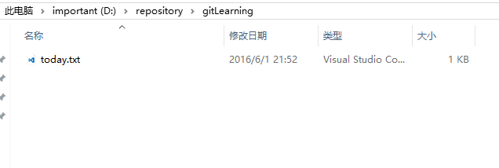
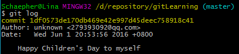
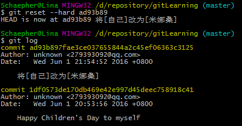
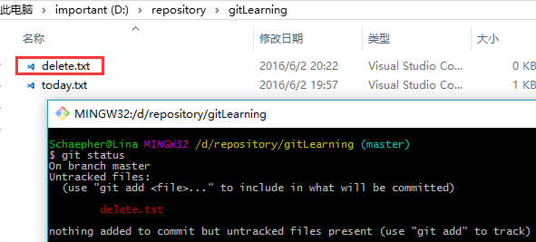
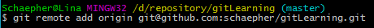

# Git和Github简单教程


网络上关于Git和GitHub的教程不少，但是这些教程有的命令太少不够用，有的命令太多，使得初期学习的时候需要额外花不少时间在一些当前用不到的命令上。  
这篇文章主要的目标是用较少的时间学习Git和GitHub的基本使用。在足够一般使用的前提下，尽量减少命令。  
如果需要其他命令，到时候再去其他地方了解就行了。

---

目录：  

  * <a href="#what">零、Git是什么</a>  
  * <a href="#function">一、Git的主要功能：版本控制</a>   
  * <a href="#overview">二、概览</a>  
  * <a href="#msysgit">三、Git for Windows软件安装</a>  
  * <a href="#local">四、本地Git的使用</a> 
  * <a href="#github">五、Github与Git的关联</a>
  * <a href="#team">六、团队合作开发</a>
  * <a href="#others">七、Github的其他介绍</a>
  * <a href="#problem">八、一些可能碰到的问题</a>  

---

<a name="what"></a>
## 零、Git是什么  
我才不告诉你嘞

---

<a name="function"></a>
## 一、Git的主要功能：版本控制 
1. 版本：  
  想想你平时用的软件，在软件升级之后，你用的就是新版本的软件。你应该见过这样的版本号：`v2.0` 或者 `1511`（表示发布时为15年11月），如下图：   
    
  那么如果你修改并保存了一个文件，从版本管理的角度来说，你得到的是这个文件的新版本。  
  可是很多情况下，这种修改是不可逆的。你修改完之后，无法回到你修改前的样子。为了避免这种情况，有的人会把新版本的内容保存到一个新的文件里面。  
  由于 Git 更多地用于代码管理，举个程序员的例子。比如以下是计算机专业学生的作业：  
    
  这样存储多个文件夹，可能会造成混乱。你可能想保存以前写的代码，因为它们可能在以后会用到。但是更多的时候是，你不知道各个文件夹都做了什么修改。  
  这时候你需要一款软件帮你管理版本，它就是Git。  
2. 控制：  
  你可以用Git来对这些不同的版本进行控制。还可以很方便地查看两个不同版本之间的不同之处。  
——使用Git，你只保存最新的一份文件就可以了。  
——那我以前的文件怎么办？  
——可以用Git的 reset 帮你把文件回退到你想要的版本。  
——如果回去了，那我的最新版本呢？  
——还可以用 reflog 和 reset 的组合来还原。

---

<a name="overview"></a>
## 二、概览  
所有命令前都要加 `git`，如表中的`init`是指 `git init`。  
点击命令可直接跳转至本文第一次使用的地方。  
以下命令都在命令行里执行。

### 1.个人本地使用  

|行为|命令|备注|
|:--|:--|:--|
|初始化|[init](#init)|在本地的当前目录里初始化git仓库|
||[clone 地址](#clone)|从网络上某个地址拷贝仓库(repository)到本地|
|查看当前状态|[status](#status)|查看当前仓库的状态。碰到问题不知道怎么办的时候，可以通过看它给出的提示来解决问题。这个命令执行的频率应该是其他命令的几倍，特别是新手|
|查看不同|[diff](#diff)|查看当前状态和最新的commit之间不同的地方|
||diff 版本号1 版本号2|查看两个指定的版本之间不同的地方。这里的版本号指的是commit的hash值|
|添加文件|[add -A](#add)|这算是相当通用的了。在commit之前要先add|
|撤回修改的且还未stage的内容|[checkout -- .](#checkout)|这里用小数点表示撤回所有修改，在`--`的前后都有空格|
|提交|[commit -m "提交信息"](#commit)|提交信息最好能体现更改了什么|
|删除未tracked|[clean -xf](#clean)|删除当前目录下所有没有track过的文件。不管它是否是.gitignore文件里面指定的文件夹和文件|
|查看提交记录|[log](#log)|查看当前版本及之前的commit记录|
||[reflog](#reflog)|HEAD的变更记录|
|版本回退|[reset --hard 版本号](#reset)|回退到指定版本号的版本，该版本之后的修改都被删除。同时也是通过这个命令回到最新版本。需要reflog配合|


### 2.个人使用远程仓库

|行为|命令|备注|
|:--|:--|:--|
|设置用户名|[config --global user.name "你的用户名"](#config_user)||
|设置邮箱|[config --global user.email "你的邮箱"](#config_email)||
|生成ssh key|[ssh-keygen -t rsa -C "你的邮箱"](#ssh_key)|这条命令前面不用加git|
|添加远程仓库|[remote add origin 你复制的地址](#remote_add)|设置origin|
|上传并指定默认|[push -u origin master](#push_origin)|指定origin为默认主机，以后push默认上传到origin上|
|提交到远程仓库|[push](#push)|将当前分支增加的commit提交到远程仓库|
|从远程仓库同步|pull|在本地版本低于远程仓库版本的时候，获取远程仓库的commit|

可以用一张图直观地看出以上主要的命令对仓库的影响。
  
图片引用自：[Git introduction for CVS/SVN/TFS users](http://blog.podrezo.com/git-introduction-for-cvssvntfs-users/)
  
  
图片引用自：[工作区和暂存区 - 廖雪峰的官方网站](http://www.liaoxuefeng.com/wiki/0013739516305929606dd18361248578c67b8067c8c017b000/0013745374151782eb658c5a5ca454eaa451661275886c6000) （做了点修改）

对照查看两张图：
* workspace 即工作区，逻辑上是本地计算机，还没添加到repository的状态；  
* staging 即版本库中的stage，是暂存区。修改已经添加进repository，但还没有作为commit提交，类似于缓存；  
* Local repository 即版本库中master那个地方。到这一步才算是成功生成一个新版本；  
* Remote repository 则是远程仓库。用来将本地仓库上传到网络，可以用于备份、共享、合作。本文将使用Github作为远程仓库的例子。

---

<a name="msysgit"></a>
## 三、Git for Windows软件安装
  
Git for Windows（又msysgit）

* 安装包可以到官方网站[^1]下载，或者在github[^2]下载。如果下载不下来，可以把链接复制下来用迅雷下载。如果用迅雷下载不放心，在下载完后去在github下载的那个地方查看SHA-256值，并和下载的文件对比，如果值一样就可以放心使用。

* 安装的时候一路点击`Next`就行了。

* 刚安装完打开后，窗口比较小。如果不太习惯，可以把它改大一些。  
   1. 首先移到窗口右下角边缘，出现箭头后把窗口拉大。
   2. 点击窗口顶部左边的图标 -> Options... -> Window -> Current size -> OK  
   这样以后打开窗口都会是调整后的大小。

> Git for Windows从2.8.0版本[^3]开始，默认添加环境变量，所以环境变量部分就不用再手动配置了。（这句可以无视）  


---

<a name="local"></a>
## 四、本地Git的使用
> 这里先不引入Github，而是在本地计算机上的操作。

打开命令行（cmd）或者在想要创建repository的地方右键鼠标并点击 `Git Bash Here` 打开窗口。

### 1.新的仓库-》初始化

运行 <a name="init">`git init`</a> 来初始化仓库，如下图：  
  

它会创建一个隐藏的文件夹 `.git` 这里不去管它是用来干嘛的。关闭windows的`显示隐藏的项目`吧。

---

### 2.文件的添加和提交
我在这个文件夹里面创建了一个 `today.txt` 的文件。并且不要脸地祝自己儿童节快乐：  

  

这时我使用 <a name="status">`git status`</a> 来查看有什么变化：  

  

它告诉我有一个还未追踪的文件，并提示我可以使用 `git add <file>...` 把它加进去。   

但是我并不打算把所有命令都介绍一遍，所以我选择使用上面概览时所提到的 <a name="add">`git add -A`</a> 命令。

  

嗯，什么提示都没有。没关系，我们再次使用 `git status` ：

  

状态变了！说明add成功。再看看它的提示 `Changes to be committed` ，也就是说现在可以执行commit了。下面一行则告诉你如何将文件从stage里移出，这里不管。  
执行 <a name="commit">`git commit -m "提交信息"`</a> 将文件提交到repository里。提交信息用英文的双引号括起来。

 

这时运行 <a name="log">`git log`</a> 就可以看到提交的记录了：  

 

这样第一步就完成了。  

> 也许你会奇怪：为什么要有一个add，直接commit不就行了？这是因为stage有很多用处，具体可以去查找相关资料。这里就算不了解问题也不大。

### 3.文件的修改

接着我修改文件内容。改成祝大家儿童节快乐好了 (～￣▽￣)～  


我们用 `git status` 看看有什么变化：  

  

这和之前的提示不一样了。之前是这个：

  

比较一下就会看到，之前的是添加新文件，当时文件还没被追踪（untracked），而这次是更改已经追踪（tracked）的文件。

现在我们通过git看看文件做了哪些变化，执行 <a name="diff">`git diff`</a> ：  

 

它默认跟最新的一个commit进行比较。  
红色（前面有减号`-`）表示删除，绿色（前面有加号`+`）表示添加。  
因此，在git看来，我们是删除了原来那一行，并添加了新的两行。这在文件内容特别多的时候效果比较明显。  
这个命令在以下情况可以使用：
* 你忘记改了什么，又想知道
* 别人发给你新版本，你想知道更改了什么

注：如果你用 windows 创建 txt 文件，并用自带文本编辑器来编辑文本，得到的编码是 GBK 。而 Git 读取文件时，使用 UTF-8 无 ROM 编码。因此会出现中文无法正常显示的情况。

假如我现在想撤销这些更改，执行 <a name="checkout">`git checkout -- .`</a> 就行了：  


恩，仍然没有任何提示。执行 `git status` 看看：  


上一个status的提示已经不见咯。再来看看文件：  


果然复原了！那么再次进行修改：


接着：  
 `git add -A`   
 `git commit -m "将[自己]改为[米娜桑]"`


用 `git log` 看看提交（commit）记录：  


嗯。现在有两个提交了。

### 4.版本回退！  

如果我写的是一篇很长的文章，并且在之前的版本基础上修改了一部分内容，生成一个新的commit，现在我发现我在修改的时候删掉了一部分内容，而这部分内容是我现在需要用到的，怎么办？版本回退！     

还是以刚才的文件为例，现在我试着将文件回退到第一个commit时的状态。但在这之前，我们看看这个文件夹里面的东西：  



`.git` 文件夹因为本来就是隐藏的，我在关了 `显示隐藏的项目` 的选项后，它就不显示了。  
现在看到的是只有一个文件，而且是最新的一个版本。  
> 文件的修改日期为 `2016/6/1 21:52`  


从刚才的 `git log` ：


我们看到两行黄色部分是以 `commit` 开头的，后面接着一串字符。这一串字符是16进制的数，是一串哈希值。我们叫它版本号就行了。

开始回退，执行 <a name="reset">`git reset --hard 1df0573`</a> （取版本号前7位就可以了）：


这里提示HEAD已经更改指向至1df0573了。此时文件：  


其内容：  


已经回到我的第一个版本的状态。  
> 这里文件的修改日期被更改为我现在的时间 `2016/6/2 19:29`  
> 这是由于文件的修改日期是由windows修改的，因为它检测到这个文件被修改了。而我们刚才从最新版本回退到现在这个版本，就像是我们手动修改了文件内容一样，事实上是由git来完成的。  
> 其实可以不管上面这一段

现在再执行  `git log` ：  



新版本的commit记录不见了！这就是 reset --hard 的力量，很好很强硬！

现在已经看到了之前版本的内容，那么如何回到最新版呢？  
先执行 <a name="reflog">`git reflog`</a> ：


可以看到HEAD的变化情况。  
第一行表示当前HEAD所在的版本号是 `1df0573` ，而之所以在这个版本号，是由于我们执行了reset命令。    
看第二行，它告诉我们，这个HEAD所在的版本号是 `ad93b89` ，这个版本号是在执行commit之后形成的。  

此时我再用一次reset，将HEAD指向 `ad93b89` ， 同时查看log ：   
```
git reset --hard ad93b89
git log
```



回到第一次reset前的状态了！


### 5.清除未追踪的文件  

通常在reset或者pull（后面会讲）之前要做两件事：  
* 将新添加且为追踪的文件删除掉（比如编译程序后所产生的文件）  
* 已追踪的文件已有修改，但又不需要这些修改，则将它们还原

还原已做修改的tracked文件，上面已经讲过。  
现在看看如何用命令删除新加的文件。

首先我手动创建个文件，用来演示：  



用checkout是没办法删除掉它的，使用 <a name="clean">`git clean -xf`</a> ：  


这个命令的杀伤力比较大，它删除当前目录下所有没有track过的文件。不管它是否是.gitignore文件里面指定的文件夹和文件。当然，也有杀伤力比较小的，但这里就不介绍了。

### 6.关于git status中文乱码问题 

如果你的文件名是中文的，在使用`git status`时会乱码。如下图所示：    

  

如果要使它显示为中文，在命令行里执行：`git config --global core.quotepath false`。  
再使用 `git status`：  


如果 `git log` 也会乱码，执行以下命令：

```
git config --global i18n.commitencoding utf-8
git config --global i18n.logoutputencoding utf-8
```

请根据需要将后面的 utf-8 替换成你想要的编码。如果是团队项目，请确保所有成员的设置都一致。

---

<a name="github"></a>
## 五、Github与Git的关联  

上面的操作都是在本地计算机上产生影响的，一般也够用了。  
如果你是程序员，想和其他人分享你的代码，或者合作开发，可以用Github。  

### 1）本地Git和Github的连接

1. 到Github[^4]注册账号。

2. 本地配置用户名和邮箱（如果已经设置好，跳过该步）：  
     * <a name="config_user">`git config --global user.name "你的用户名"`</a>  
       <a name="config_email">`git config --global user.email "你的邮箱"`</a>  
       如图所示：    
          
     * 或者你直接在config文件里改，位置在 `C:\Users\你的用户名\.gitconfig` 。如下图所示，添加相应信息：  
        
       
3. 生成ssh key  
   运行 <a name="ssh_key">`ssh-keygen -t rsa -C "你的邮箱"`</a> ，它会有三次等待你输入，直接回车即可。  
      
   将生成的ssh key复制到剪贴板，执行 `clip < ~/.ssh/id_rsa.pub` （或者到上图提示的路径里去打开文件并复制）：  
     
4. 打开Github，进入Settings：  
      
   点击左边的 `SSH and GPG keys` ，将ssh key粘贴到右边的Key里面。Title随便命名即可。  
     
   点击下面的 `Add SSH key` 就添加成功了。  
   测试一下吧，执行 `ssh -T git@github.com` ：   
     
   嗯，这样就成功了！  
   
   注：  
   - 对于 oschina 的 “码云” ，执行 `ssh -T git@git.oschina.net`  
   - 对于 coding 的 “码市” ，执行 `ssh -T git@git.coding.net`


### 2）创建远程仓库并与本地关联
   1. 创建远程仓库  
      首先是在右上角点击进入创建界面：
      
       
      
      接着输入远程仓库名：
      
       
      
      点击 `Create repository` 就创建好了。其他选项可以暂时不管。

   2. 将远程仓库和本地仓库关联起来  
      
      先到Github上复制远程仓库的SSH地址：
      
       
      
      有两种方式可以关联，一种是SSH，一种是HTTPS。由于**HTTPS比较慢**，所以推荐使用SSH。  
      注意SSH的地址格式是这样开头的： `git@github.com`
      
      运行 <a name="remote_add">`git remote add origin 你复制的地址`</a> ：
      
      
      
      如果你在创建 repository 的时候，加入了 README.md 或者 LICENSE ，那么 github 会拒绝你的 push 。你需要先执行 `git pull origin master`。

      执行 <a name="push_origin">`git push -u origin master`</a> 将本地仓库上传至Github的仓库并进行关联：
      
      
      
关联已经完成！
      
以后想在commit后同步到Github上，只要直接执行 <a name="push">`git push`</a> 就行啦：  


可以在Github上看到修改：


---

<a name="team"></a>
## 六、团队合作开发  
关于团队合作开发，我在之前已经专门用一篇文章来说明了。  
原文链接： [GitHub团队项目合作流程](http://www.cnblogs.com/schaepher/p/4933873.html)  

上文的目录：  

  * <a href="http://www.cnblogs.com/schaepher/p/4933873.html#first">零、前期准备</a>  
  * <a href="http://www.cnblogs.com/schaepher/p/4933873.html#second">一、创建开发分支</a>   
  * <a href="http://www.cnblogs.com/schaepher/p/4933873.html#third">二、Fork项目到个人的仓库</a>  
  * <a href="http://www.cnblogs.com/schaepher/p/4933873.html#four">三、Clone项目到本地</a>  
  * <a href="http://www.cnblogs.com/schaepher/p/4933873.html#five">四、和团队项目保持同步</a> 
  * <a href="http://www.cnblogs.com/schaepher/p/4933873.html#six">五、push修改到自己的项目上</a>
  * <a href="http://www.cnblogs.com/schaepher/p/4933873.html#seven">六、请求合并到团队项目上</a>
  * <a href="http://www.cnblogs.com/schaepher/p/4933873.html#eight">七、团队项目负责人审核及同意合并请求</a>  
  
其中 `零、一、七` 是由团队项目负责人来完成的。

---

<a name="others"></a>
## 七、Github的其他介绍  

### 1）获取其他人的远程仓库  
看到别人的代码，想要获取到本地计算机慢慢研究或者修改，可以用Git将其下载下来。  
以我和一位同学合作的仓库为例，链接：[schaepher/blogsbackup](https://github.com/schaepher/blogsbackup)   
> 这是我们用来备份博客园博客的一个小程序，主要用于助教备份学生的博客。
 
1. 复制别人远程仓库的SSH。方法和上面关联git一样，进入仓库页面后，就能找到SSH地址。  
    
    

2. 执行 <a name="clone">`git clone 复制的SSH地址`</a>

    

    整个项目42M，花了点时间才clone下来。  
    
有一点要注意：这样直接clone别人的仓库后，不能push上自己的修改。  

### 2）另一种关联远程空仓库的方法

在知道了clone之后，你就可以更简单的创建并关联一个空仓库了。  
1. 在Github上创建仓库，上面有提到，这里不多讲
2. 复制刚才创建的仓库的SSH
3. clone到本地  

这样可以不用再做关联了。省去了上面的 `init` 和 `git remote add origin` 以及 `git push -u origin master` 。


### 3）使用GitHub的好处  
* 全球最大的同♂性交友网站（逃  
* （严肃脸）很多牛逼程序员和牛逼公司的开源项目都放在这上面，有丰富的资源可以学习
* 别人（如HR）可以通过你的Github大致了解你的水平。《[怎样花两年时间去面试一个人](http://mindhacks.cn/2011/11/04/how-to-interview-a-person-for-two-years/)》 这篇文章的后面部分讲到了Github

---

<a name="problem"></a>
## 八、一些可能碰到的问题
这篇文章基本只介绍主线操作，而在操作过程中，可能有误操作或者其他问题。我把这些问题集中放在另一篇博客里面（这里列出目录）。这样这篇文章不会显得太长。

  * <a href="http://www.cnblogs.com/schaepher/p/4970291.html#conflict">一、 解决merge时出现的冲突</a> 
  * <a href="http://www.cnblogs.com/schaepher/p/4970291.html#back">二、 回退一个merge</a>
  * <a href="http://www.cnblogs.com/schaepher/p/4970291.html#pick">三、 获取某一commit的修改</a>
  * <a href="http://www.cnblogs.com/schaepher/p/4970291.html#push_force">四、 将低版本push到Github（删掉高版本Commit）</a>


---


[^1]: https://git-for-windows.github.io (msysgit official website)
[^2]: https://github.com/git-for-windows/git/releases
[^3]: https://github.com/git-for-windows/git/releases/tag/v2.8.0.windows.1 "查看2.8.0版本的Release Note"
[^4]: https://github.com/join?source=header

