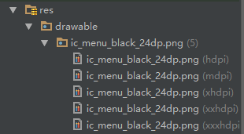

# Android带侧滑菜单和ToolBar的BaseActivity


<!-- TOC depthFrom:1 depthTo:6 insertAnchor:true orderedList:false updateOnSave:false withLinks:true -->

- [一、Navigation Drawer](#一navigation-drawer)
- [二、ToolBar](#二toolbar)
- [三、参考链接](#三参考链接)

<!-- /TOC -->
写Android的时候，可能有多个界面。在风格统一的软件中，写Activity时会有很多重复。例如我所在软工课程小组的项目：[Github链接](https://github.com/schaepher/CourseManagement/tree/master/CourseManagement/app/src/main/java/com/ftd/schaepher/coursemanagement/activities) ，里面的TaskListActivity和TeacherListActivity就在Navigation的处理上有重复。还有一个双击退出APP的方法`onBackPressed()`也重复实现了。之前让负责界面的同学把这些代码放到一个BaseActivity里面，让其他Activity继承它。他说不好做，他尝试过，但失败了。  


于是这次我独自做 [英语词典APP](http://www.cnblogs.com/schaepher/p/5634529.html) 的时候 ，经过在Google上的一番搜索和实践探索，写出一个还可以的BaseActivity。现在做个记录，以后还会用得到。  
**[BaseActivity项目的Github链接](https://github.com/schaepher/AndroidBaseActivity)**  

这个BaseActivity包括侧滑菜单（Navigation Drawer）和工具栏（Tool Bar）。  
先看最终效果：  


<a id="markdown-一navigation-drawer" name="一navigation-drawer"></a>
##  一、Navigation Drawer
由于Navigation Drawer涉及到BaseActivity的主要布局，所以先说明。  


1. Activity的布局文件  
先看Android官方Navigation Drawer说明：[Creating a Navigation Drawer](https://developer.android.com/training/implementing-navigation/nav-drawer.html)    
根据说明，将 `layout/activity_base.xml` 设置为以下内容：  
    ```xml
    <?xml version="1.0" encoding="utf-8"?>
    <android.support.v4.widget.DrawerLayout
        android:id="@+id/drawer_layout"
        xmlns:android="http://schemas.android.com/apk/res/android"
        android:layout_width="match_parent"
        android:layout_height="match_parent">
        <!-- 主内容布局 -->
        <FrameLayout
            android:id="@+id/content_frame"
            android:layout_width="match_parent"
            android:layout_height="match_parent"/>
        <!-- 侧滑菜单 -->
        <ListView
            android:id="@+id/left_drawer"
            android:layout_width="240dp"
            android:layout_height="match_parent"
            android:layout_gravity="start"
            android:background="#111"
            android:choiceMode="singleChoice"
            android:divider="@android:color/transparent"
            android:dividerHeight="0dp"/>
    </android.support.v4.widget.DrawerLayout>
    ```
    > Android Studio不会提示android:layout_gravity这一项，但是整行敲完之后，可以正常运行。

2. 侧滑菜单列表布局  
    这里只做简单的布局，所以侧滑菜单项都是TextView。  
    创建 `layout/list_item_drawer.xml`：   
    ```xml 
    <?xml version="1.0" encoding="utf-8"?>

    <TextView
        android:id="@+id/tv_na_draw"
        xmlns:android="http://schemas.android.com/apk/res/android"
        android:layout_width="match_parent"
        android:layout_height="wrap_content"
        android:textSize="30sp"
        android:textColor="#fff"/>
    ```
    > 因为等会儿要用ArrayAdapter，所以这里最外层一定要是TextView。  

3. 侧滑菜单项的文本    
    [StringArray](https://developer.android.com/guide/topics/string-resource.html#StringArray)  
    创建 `values/string_array_test.xml` ：  
    ```xml
    <?xml version="1.0" encoding="utf-8"?>
    <resources>
        <string-array name="planets_array">
            <item>主界面</item>
            <item>关于</item>
            <item>设置</item>
            <item>退出</item>
        </string-array>
    </resources>
    ```   

4. Activity初始化  
    [Initialize the Drawer List](https://developer.android.com/training/implementing-navigation/nav-drawer.html#Init)  
    这里由于要将Activity做成BaseActivity，所以和官方文档上的代码不太一样。  
    ```java
    public class BaseActivity extends AppCompatActivity {
        protected String[] planetTitles;
        protected DrawerLayout drawerLayout;
        protected ListView drawerList;
        protected FrameLayout frameLayout;

        @Override
        protected void onCreate(Bundle savedInstanceState) {
            super.onCreate(savedInstanceState);
        }

        /**
        * 重写setContentView，以便于在保留侧滑菜单的同时，让子Activity根据需要加载不同的界面布局
        */
        @Override
        public void setContentView(@LayoutRes int layoutResID) {
            drawerLayout = (DrawerLayout) getLayoutInflater().inflate(R.layout.activity_base, null);
            frameLayout = (FrameLayout) drawerLayout.findViewById(R.id.content_frame);
            // 将传入的layout加载到activity_base的content_frame里面
            getLayoutInflater().inflate(layoutResID, frameLayout, true);
            super.setContentView(drawerLayout);

            setUpNavigation();
        }

        private void setUpNavigation() {
            planetTitles = getResources().getStringArray(R.array.planets_array);
            drawerList = (ListView) findViewById(R.id.left_drawer);
            drawerList.setAdapter(new ArrayAdapter<>(BaseActivity.this,
                    R.layout.list_item_drawer, planetTitles));
        }
    }
    ```

5. MainActivity  
    先创建个Activity查看效果。  
    创建MainActivity继承BaseActivity ：  
    ```java
    public class MainActivity extends BaseActivity {

        @Override
        protected void onCreate(Bundle savedInstanceState) {
            super.onCreate(savedInstanceState);
            setContentView(R.layout.activity_main);
        }
    }
    ```
    layout_main用的是默认布局。  
    在启动前要更改 `AndroidManifest.xml` ，将MainActivity设置成Launcher：  
    ```xml
    <activity android:name=".MainActivity">
        <intent-filter>
            <action android:name="android.intent.action.MAIN"/>

            <category android:name="android.intent.category.LAUNCHER"/>
        </intent-filter>
    </activity>
    ```
    启动后，手指从最左往右划，打开侧滑菜单。  
    

6. 添加侧滑菜单点击事件  
    [Handle Navigation Click Events](https://developer.android.com/training/implementing-navigation/nav-drawer.html#ListItemClicks)  
    先创建ClickListener，这里简单地设置点击后显示所点击的文本。  
    在BaseActivity中添加：  

    ```java
    private class DrawerItemClickListener implements ListView.OnItemClickListener {
        @Override
        public void onItemClick(AdapterView<?> parent, View view, int position, long id) {
            selectItem(position);
        }
    }

    private void selectItem(int position) {
        Toast.makeText(BaseActivity.this, planetTitles[position], Toast.LENGTH_SHORT).show();
    }
    ```

    在BaseActivity的 `setUpNavigation()` 中添加：  
    ```java
    drawerList.setOnItemClickListener(new DrawerItemClickListener());
    ```
    

<a id="markdown-二toolbar" name="二toolbar"></a>
##  二、ToolBar

1. ToolBar 布局   
    ToolBar的各个成分：  
    

    [Setting Up the App Bar](https://developer.android.com/training/appbar/setting-up.html)      
    打开AndroidManifest.xml，将里面的 `android:theme="@style/AppTheme"` 替换成 `android:theme="@style/Theme.AppCompat.Light.NoActionBar"`，如下：  
    ```xml
    <application
            android:allowBackup="true"
            android:icon="@mipmap/ic_launcher"
            android:label="@string/app_name"
            android:supportsRtl="true"
            android:theme="@style/Theme.AppCompat.Light.NoActionBar">
    ...（三点表示省略，下同）
    ```

    创建 `layout/toolbar.xml` ：  
    ```xml
    <?xml version="1.0" encoding="utf-8"?>
    <merge xmlns:android="http://schemas.android.com/apk/res/android"
        xmlns:app="http://schemas.android.com/apk/res-auto"
        android:layout_width="match_parent"
        android:layout_height="wrap_content">

        <android.support.v7.widget.Toolbar
            android:id="@+id/toolbar"
            android:layout_width="match_parent"
            android:layout_height="?attr/actionBarSize"
            android:background="?attr/colorPrimary"
            android:elevation="4dp"
            android:theme="@style/ThemeOverlay.AppCompat.ActionBar"
            app:popupTheme="@style/ThemeOverlay.AppCompat.Light"/>

    </merge>
    ```

2. ToolBar 初始化  
    在BaseActivity里添加：  
    ```java
    public class BaseActivity extends AppCompatActivity {
        ...
        private Toolbar toolbar;

        ...
        private void setUpToolBar() {
            toolbar = (Toolbar) findViewById(R.id.toolbar);
            setSupportActionBar(toolbar);
        }
    }
    ```
    在BaseActivity的 `setContentView()` 里的 `setUpNavigation();`下面添加`setUpToolBar();`，如下：  
    ```java
    @Override
    public void setContentView(@LayoutRes int layoutResID) {
        ...
        setUpNavigation();
        setUpToolBar();
    }
    ```
    如果想要在MainActivity里显示ToolBar，还需要在 `activity_main.xml` 里include一个ToolBar的布局：
    ```xml
    <?xml version="1.0" encoding="utf-8"?>
    <RelativeLayout ...>

        <include layout="@layout/toolbar"/>

    </RelativeLayout>
    ```
    显示的效果如下：  
    

3. 加入侧滑菜单打开键  
    到 [Material Design Icons](https://design.google.com/icons/) 下载图标。搜索menu，下载PNG版本。  
    
    解压后，将 `ic_menu_black_24dp/android` 文件夹下面的所有文件夹复制到 `res/` 里面。
      
    在BaseActivity的 `setUpToolBar()` 中添加：  
    ```java
    toolbar.setNavigationIcon(R.drawable.ic_menu_black_24dp);
    ```
      
    虽然有图标，但是还没设置点击事件，所以点击的时候没有任何反应。  

4. 点击ToolBar的home按钮打开Navigation Drawer  
    在BaseActivity里添加：  
    ```java
    @Override
    public boolean onOptionsItemSelected(MenuItem item) {
        switch (item.getItemId()) {
            case android.R.id.home:
                drawerLayout.openDrawer(GravityCompat.START);
                return true;
            default:
                break;
        }
        return super.onOptionsItemSelected(item);
    }
    ```
    这里就省略ActionBarDrawerToggle的部分了，影响不是特别大。实际应用中再去添加。

5. 添加Option Menu  
    在 `values/strings.xml` 里添加等会儿会用到的字符串：  
    ```xml
    <resources>
        ...
        <string name="edit">编辑</string>
        <string name="search">搜索</string>
        <string name="change_history">变更记录</string>
    </resources>
    ```
    去 [Material Design Icons](https://design.google.com/icons/) 下载相关图标。  
    创建 `res/menu/menu_main.xml` ：
    ```xml
    <?xml version="1.0" encoding="utf-8"?>
    <menu android:id="@+id/expanded_menu"
        xmlns:android="http://schemas.android.com/apk/res/android"
        xmlns:app="http://schemas.android.com/apk/res-auto">

        <item
            android:id="@+id/menu_edit"
            android:icon="@drawable/ic_mode_edit_black_24dp"
            android:title="@string/edit"
            app:showAsAction="ifRoom"/>

        <item
            android:id="@+id/menu_search"
            android:icon="@drawable/ic_search_black_24dp"
            android:title="@string/search"
            app:showAsAction="ifRoom"/>

        <item
            android:id="@+id/menu_change_history"
            android:icon="@drawable/ic_change_history_black_24dp"
            android:title="@string/change_history"
            app:showAsAction="never"/>

    </menu>
    ```  
    其中ifRoom表示如果ToolBar空间足够，则将其图标显示在ToolBar上面。never表示永不显示在ToolBar上面，只有当点击option menu按钮的时候，才会出现。  
    在BaseActivity中添加：  
    ```java
    @Override
    public boolean onCreateOptionsMenu(Menu menu) {
        getMenuInflater().inflate(R.menu.menu_main, menu);
        super.onCreateOptionsMenu(menu);
        return true;
    }
    ```
    启动APP：  
      
    点击menu按钮后：  
    

6. Option Menu的点击事件  
    在BaseActivity里的 `onOptionsItemSelected()` 增加case即可。

7. 隐藏ActionBar的Option Menu  
    有时候不想在某个Activity中显示Option Menu，于是修改BaseActivity：  
    ```java
    public class BaseActivity extends AppCompatActivity {
        ...
        private boolean showOptionMenu = true;

        ...
        protected void hideOptionMenu() {
        	showOptionMenu = false;
        }

        @Override
        public boolean onCreateOptionsMenu(Menu menu) {
            if (showOptionMenu) {
                getMenuInflater().inflate(R.menu.menu_main, menu);
            }
            super.onCreateOptionsMenu(menu);
            return true;
        }

    }
    ```

<a id="markdown-三参考链接" name="三参考链接"></a>
##  三、参考链接

1. ToolBar  
https://developer.android.com/training/appbar/setting-up.html
https://developer.android.com/training/appbar/actions.html
http://stackoverflow.com/questions/32367041/calling-toolbar-on-each-activity
http://stackoverflow.com/questions/30824324/clicking-hamburger-icon-on-toolbar-does-not-open-navigation-drawer 
http://stackoverflow.com/questions/19724567/how-to-add-menu-indicator-next-to-action-bars-app-icon
http://stackoverflow.com/questions/26582075/cannot-catch-toolbar-home-button-click-event

2. Navigation Drawer  
https://developer.android.com/training/implementing-navigation/nav-drawer.html
http://stackoverflow.com/questions/33009469/baseactivity-for-navigation
http://stackoverflow.com/questions/22652556/creating-base-activity-with-navigation-drawer-in-android

3. ArrayAdapter  
http://stackoverflow.com/questions/9280965/arrayadapter-requires-the-resource-id-to-be-a-textview-xml-problems  
http://stackoverflow.com/questions/29591546/unable-to-use-layout-gravity-for-listview-inside-drawerlayout

4. String Array
https://developer.android.com/guide/topics/string-resource.html#StringArray
 
5. Material icons
https://design.google.com/icons/


