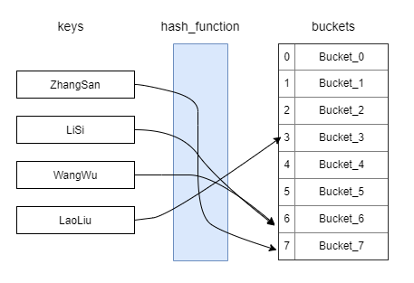
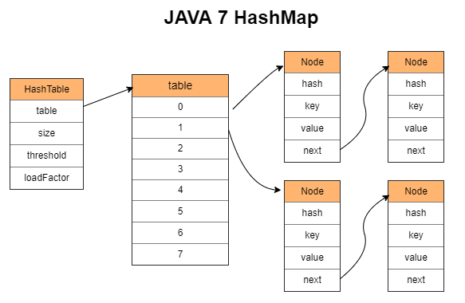
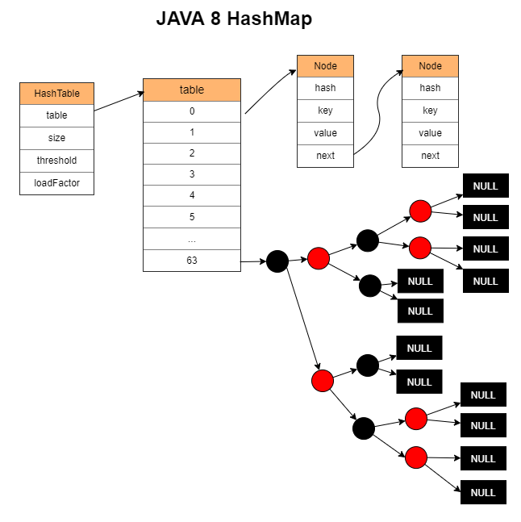
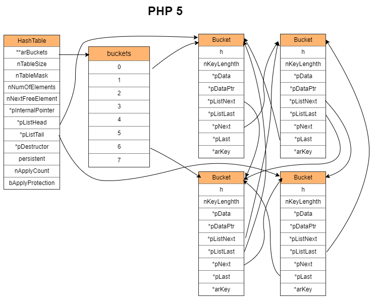
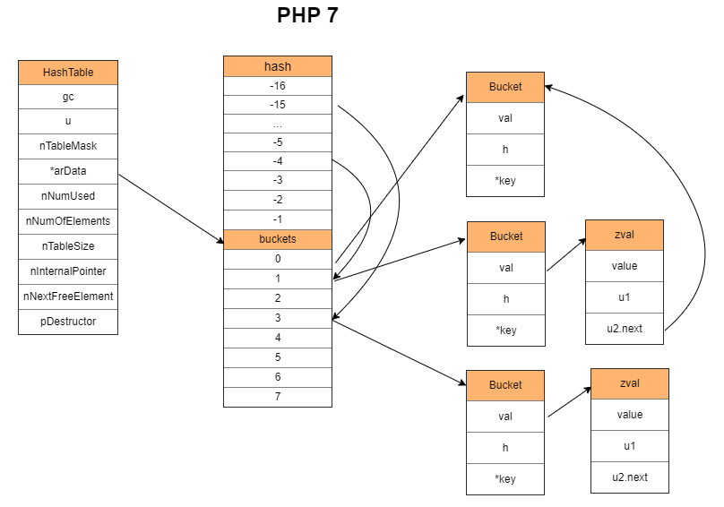
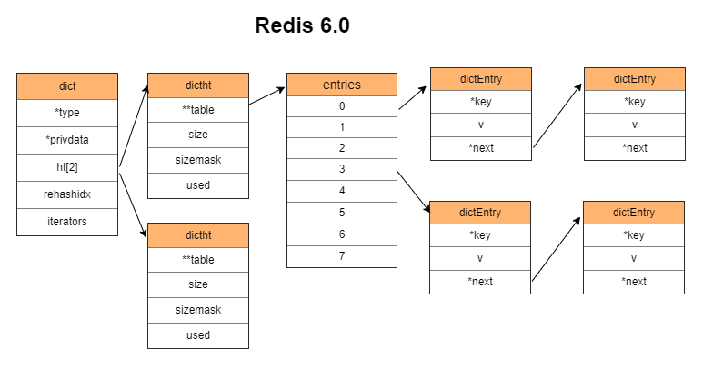
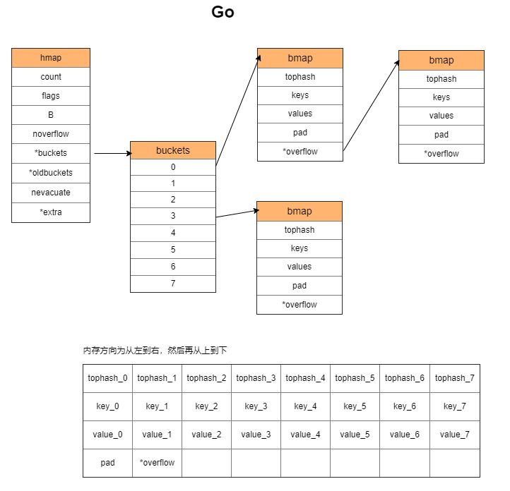

# 【数据结构】Map （映射）的各种实现


> In computer science, an associative array, map, symbol table, or dictionary is an abstract data type composed of a collection of (key, value) pairs, such that each possible key appears at most once in the collection. —— wikipedia  
> 在计算机科学中，关联数组、映射、符号表或者字典是一种由一系列(键、值)对组成的集合，且集合中的每个键最多出现一次。 —— 维基百科

Map 作为一种高效的数据存取数据结构，经常会被用到。在不同的场合，其具体实现上会有一定的差异，但总体上是相似的。其思想甚至可以扩展到很多地方。

<!-- more -->

## Map 的分类

Map 实现方式总体上分为两类：  

- 哈希表（Hash Table）
- 红黑树（Red-Black Tree）

大多数的实现都会选择 Hash Table，因为它的平均时间复杂度为 O(1)，而红黑树是 O(log N)。    

Hash Table 之所以快，是因为它通过哈希函数和掩码将 key 转化为一个范围内的整数，通过将这个整数作为在数组中的索引，获取存储在数组中的碰撞链。这个查找过程是通过直接计算数组索引的地址偏移量来得到碰撞链的地址，速度极快。



如果哈希函数不是特别差，碰撞链平均元素个数在 8 个左右。最坏的情况下是所有 key 在转化后得到相同的整数，此时只有一条碰撞链，平均时间复杂度为 O(N)。

如果想要知道 Map 具体的不同实现方式，可以看 JAVA 中 java.util.Map 接口的实现。这里列出其中几种：  

|类型|数据结构|遍历|线程安全|
|:--|:--|:--|:--|
|HashMap|Hash Table|随机|否|
|LinkedHashMap|Hash Table|按添加顺序|否|
|ConcurrentHashMap|Hash Table|随机|是|
|Hashtable|Hash Table|随机|是|
|ConcurrentSkipListMap|Skip Table|按键升序排序的顺序|是|
|TreeMap|Red Black Tree|按键升序排序的顺序|否|

> 更多实现可看：  
> [https://docs.oracle.com/javase/8/docs/api/java/util/Map.html](https://docs.oracle.com/javase/8/docs/api/java/util/Map.html)

这里会看到 ConcurrentHashMap 和 Hashtable 似乎是一样的。它们两者的主要区别在于， Hashtable 为了线程安全，所有操作都会锁住整个 Hash Table；而 ConcurrentHashMap 则仅对冲突链（key 有相同的 Hash 值）加锁，即分段锁。

## 各种场景下的实现

其他一些场景下，没有像 JAVA 一样提供多种实现。因此这里将这些实现对应到 JAVA 上来，尽管具体实现细节上会有差异。

|场景|类似的 JAVA 实现|
|:--|:--|
|PHP5 的数组|LinkedHashMap|
|PHP7 的数组|LinkedHashMap|
|Redis 的字典|HashMap|
|Go 的 map|HashMap|
|Go 的 sync.map|Hashtable|

> 这里特别备注一下， Go 的 sync.map 的实现是在 map 的基础上加了一层线程安全机制，底层用的还是 map。因此以下说明其他 Map 特性的时候，不再列出 sync.map。  
> PHP 在 Thread Safe 版本中提供了 Hash Table 的线程安全版本，在读写操作前对整个 Hash Table 加锁。  

这些实现都采用 Hash Table，因此以下仅介绍 Hash Table 的几个重点和不同场景在实现上的区别。

先直观地看看它们结构上的区别吧！

JAVA 7：

每个 key-value 对都单独存储一个节点，并链接到下一个节点。



JAVA 8:

JAVA 7 的升级，当 table 的长度大于等于 64 且链表的元素个数大于等于 8 时，将链表转换成红黑树。




PHP 5：

和 JAVA 7 的基本思路一样，都是每个 key-value 对都单独存储一个节点，并链接到下一个节点。但是由于要保证数据按加入时的顺序遍历，因此会多出一套指针用于记录元素加入的前后顺序。



PHP 7：

和 PHP 5 不一样，除了 hash 数组外，还增加了数据数组，其全局顺序按照加入顺序放到数据数组中，这样 Bucket 就可以删除用于标识全局顺序的指针了。



Redis 6：

每个 key-value 对都单独存储一个节点，并链接到下一个节点。



Go：

与前面几种都不一样。Go 把多组 key-value 对放在一个 bmap 里面，一个 bmap 可容纳 8 个对。如果不够，则再申请一个 bmap 链接到原来的 bmap 上。



## Hash Table 的四个问题

- 如何计算哈希值
- 如何处理哈希碰撞
- 什么时候扩容
- 如何扩容

哈希函数用于获取 key 的哈希值。最终哈希值会与掩码执行`按位与`操作，仅根据数组的长度保留最后几位。哈希算法的好坏影响了冲突的概率，从而影响 Hash Table 的效率。最坏的情况下会使得 Hash Table 退化为链表，从 O(1) 降到 O(N)。

哈希碰撞是指两个不同 key 得到后几位相同的哈希值。碰撞的解决方式就是组织这些 `<key, value>` 的方式。

扩容指元素达到一定数量时，申请的内存即将不够用（例如 PHP7 为键值对申请的固定长度数组），或者哈希冲突越来越多导致冲突链变长，此时应该执行扩容以获取更多内存或者减小冲突。

Rehash 是指对所有键值对的 key 重新做一次 Hash 操作，然后和新容量对应的掩码做`按位与`操作，得到新的冲突链索引。这样在扩容或者其他情况的时候，可以重新组织元素所在的位置。

## 问题一：如何计算哈希值

> 以下是这部份的参考：  
> 几种常见的hash函数  
> [https://www.jianshu.com/p/bb64cd7593ab](https://www.jianshu.com/p/bb64cd7593ab)  
> 常见的哈希算法和用途  
> [https://blog.cyeam.com/hash/2018/05/28/hash-method](https://blog.cyeam.com/hash/2018/05/28/hash-method)  
> 漫谈非加密哈希算法  
> [https://segmentfault.com/a/1190000010990136](https://segmentfault.com/a/1190000010990136)

hash 函数用于获取 key 的哈希值，即 `hash = hash_function(key)`。  

hash 函数有两种分类：  

- 加密型（md5，sha1，sha256，aes256 ...）
- 非加密型（通常用于查找）

Map 实现所用到的 hash 函数通常是非加密型的，它的速度比加密型快，但也更容易产生 hash 碰撞。

hash 碰撞指的是不同的 key 在经过 hash 函数处理后得到二进制后几位相同的 hash 值。  

hash 函数涉及到安全问题，主要是避免被攻击者知道 hash 规则，借以生成大量碰撞的 key 执行攻击。

Map 的 key 的类型在有些实现中有限制，另外一些没有限制。这里只取 key 为字符串类型的情况来介绍。  

这个知识点基本上属于满足好奇心。其他情况例如面试的时候，面试官不会问。毕竟像最常用的 times33 算法中的 5381 和 33 两个参数都是玄学数字，是基于实验比较出来的，没什么好说。

### Redis 的哈希函数

Redis 使用的是 SipHash 实现，这个实现的特点是解决 Hash-Flooding Attack 这个安全问题。  

> 什么是哈希洪水攻击（Hash-Flooding Attack）？ - Gh0u1L5的回答 - 知乎  
> [https://www.zhihu.com/question/286529973/answer/676290355](https://www.zhihu.com/question/286529973/answer/676290355)

`src/dict.c`

```c
/* The default hashing function uses SipHash implementation
 * in siphash.c. */
// ...
uint64_t dictGenHashFunction(const void *key, int len) {
    return siphash(key,len,dict_hash_function_seed);
}
```

SipHash 的具体实现见 `src/siphash.c`。

除了 SipHash 外，还有一种 Bernstein's Hash（别名 DJB，DJBX33A，times33）。

下面这个是 Redis 的 C 语言客户端中的：

`deps/hiredis/dict.c`

```c
/* Generic hash function (a popular one from Bernstein).
 * I tested a few and this was the best. */
static unsigned int dictGenHashFunction(const unsigned char *buf, int len) {
    unsigned int hash = 5381;

    while (len--)
        hash = ((hash << 5) + hash) + (*buf++); /* hash * 33 + c */
    return hash;
}
```

这里把 `hash * 33` 的操作改为位操作 `(hash << 5) + hash`，意思是 `x*2^5+ x*1 = x*(2^5 + 1)`，目的是为了加速。

### JAVA 的哈希函数

JAVA 的实现是基于 times33 的改变，它把 33 改成了 31，并且缓存字符串的 hash 值。

`java.lang.String`

```java
public final class String
    implements java.io.Serializable, Comparable<String>, CharSequence {
    // ...
    /** Cache the hash code for the string */
    private int hash; // Default to 0
    // ...
    public int hashCode() {
        int h = hash;
        if (h == 0 && value.length > 0) {
            char val[] = value;

            for (int i = 0; i < value.length; i++) {
                h = 31 * h + val[i];
            }
            hash = h;
        }
        return h;
    }
    // ...
}
```

如果只是单纯地使用这个 hash 函数，那么会遭受到 Hash-Flooding Attack。从 JAVA 8 开始，对哈希碰撞采取了将过长的哈希链转换为红黑树来解决这个问题。后面会详细说明。  

### PHP 5 的哈希函数

PHP 5 也是基于 times33 的改变，它主要是减少了循环的次数。存在 Hash-Flooding Attack 安全问题。

`src/Zend/zend_string.h`

```c
static inline ulong zend_inline_hash_func(const char *arKey, uint nKeyLength)
{
    register ulong hash = 5381;

    /* variant with the hash unrolled eight times */
    for (; nKeyLength >= 8; nKeyLength -= 8) {
        hash = ((hash << 5) + hash) + *arKey++;
        hash = ((hash << 5) + hash) + *arKey++;
        hash = ((hash << 5) + hash) + *arKey++;
        hash = ((hash << 5) + hash) + *arKey++;
        hash = ((hash << 5) + hash) + *arKey++;
        hash = ((hash << 5) + hash) + *arKey++;
        hash = ((hash << 5) + hash) + *arKey++;
        hash = ((hash << 5) + hash) + *arKey++;
    }
    switch (nKeyLength) {
        case 7: hash = ((hash << 5) + hash) + *arKey++; /* fallthrough... */
        case 6: hash = ((hash << 5) + hash) + *arKey++; /* fallthrough... */
        case 5: hash = ((hash << 5) + hash) + *arKey++; /* fallthrough... */
        case 4: hash = ((hash << 5) + hash) + *arKey++; /* fallthrough... */
        case 3: hash = ((hash << 5) + hash) + *arKey++; /* fallthrough... */
        case 2: hash = ((hash << 5) + hash) + *arKey++; /* fallthrough... */
        case 1: hash = ((hash << 5) + hash) + *arKey++; break;
        case 0: break;
EMPTY_SWITCH_DEFAULT_CASE()
    }
    return hash;
}
```

### PHP 7 的哈希函数

PHP 7 的实现比 PHP 5 复杂一些，它针对了不同操作系统以及处理其做了优化，但本质上还是使用 times33。存在 Hash-Flooding Attack 安全问题。

`src/Zend/string.h`

```c
static zend_always_inline zend_ulong zend_inline_hash_func(const char *str, size_t len)
{
    zend_ulong hash = Z_UL(5381);

#if defined(_WIN32) || defined(__i386__) || defined(__x86_64__) || defined(__aarch64__)
    /* Version with multiplication works better on modern CPU */
    for (; len >= 8; len -= 8, str += 8) {
# if defined(__aarch64__) && !defined(WORDS_BIGENDIAN)
        // ...
# else
        // ...
# endif
    }
        // ...
#else
        // ... 这里和 PHP 5 一样
#endif
}
```

### Go 的哈希函数

Go 在 1.17 版本之前使用的是基于 xxhash 和 cityhash 改进的算法。为了解决 Hash-Flooding Attack 这个安全问题，初始化 map 时随机 hash seed，使得不同 map 对相同 key 的 hash 结果不一致。  

随机数：

```go
// A header for a Go map.
type hmap struct {
    // ... 省略
    hash0     uint32 // hash seed
    // ... 省略
}
```

hash 算法位置：

`src/runtime/hash64.go`

```go
// Hashing algorithm inspired by
//   xxhash: https://code.google.com/p/xxhash/
// cityhash: https://code.google.com/p/cityhash/
```

具体实现太长就不贴出来了。

go 1.17 把换成了 wyhash

```go
// Hashing algorithm inspired by
// wyhash: https://github.com/wangyi-fudan/wyhash
```

## 问题二：如何处理哈希碰撞

hash 碰撞的处理方式有几种：  

- 链地址法
- 开放地址法
    + 线性探测法
    + 二次探测法（平方探测法）
    + 双散列法
    + 伪随机探测法
- 再哈希法（Rehashing）
- 公共溢出区法

下表展示了各种 Map 实现使用的碰撞处理方式：  

|场景|碰撞处理方式|
|:--|:--|
|JAVA 的 HashMap|链地址法|
|PHP5 的数组|链地址法|
|PHP7 的数组|链地址法|
|Go 的 map|链地址法|
|Redis 的 hash|链地址法|

尽管都是使用链地址法，但链地址法的具体实现却不相同。

### JAVA HashMap 的冲突链


链表存储在 table 数组中。

每当添加一个元素，就 new 一个 Node，把 key 和 value 存进去。接着链接到冲突链上。

对于 Node 插入到冲突链的位置，JAVA 8 之前和 JAVA 8 开始，有两种不同的方式。

JAVA 8 之前，将 Node 插入到链表头部（头插法）。  

JAVA 8 开始，将 Node 插入到链表尾部（尾插法）。

使用尾插法的原因是头插法在扩容的时候有可能会出现环。因为头插法会在扩容时使得链表前后两个节点的位置对调。如果冲突链前后两个节点在扩容后仍然位于同一条冲突链，就有可能出现这种情况。


上面说到 JAVA 8 的 HashMap 解决 Hash-Flooding Attack 的安全问题，是在链表同时满足两个条件的情况下转化为红黑树。

1. table 的长度大于等于 64  
    如果不满足该条件，则 table 双倍扩容。
2. 链表的元素个数大于等于 8

在红黑树的情况下，如果元素个数小于等于 6，则将红黑树还原为链表。使用 6 而不是 7 是为了避免频繁地在红黑树和链表之间转换。

### JAVA LinkedHashMap 的冲突链

LinkedHashMap 继承了 HashMap。并且添加了 head 和 tail 用于存储双向链表。

每当添加一个元素，除了 HashMap 的处理，还会额外地将该元素放到 tail 后面。遍历的时候按添加顺序遍历。

### PHP 5 数组的冲突链


链表存储在 arBuckets 中。每个 Bucket 存储一个元素。  

每当添加一个元素，先申请一个 Bucket 内存，然后再把 key 和 value 拷贝进去，最后把 Bucket 链接到链表的头部（头插法）。

所有元素的内存不是一整块连续的内存。

Bucket 自身维护了全局添加顺序的上下元素的指针。

### PHP 7 数组的冲突链


链表存储在 arData 中。每个 Bucket 存储一个元素。

内存会预先申请好连续的 nTableSize 个 Bucket 的空间（数组）。

每当添加一个元素，会使用 nNextFreeElement 指向的 Bucket，把 key 和 value 拷贝进去，最后把 Bucket 链接到链表的头部（头插法）。图中 Bucket 是包含了 zval，应看做一个整体而不是冲突链的两个元素。

用于存储元素值的 zval 维护了冲突链下一个 Bucket 的指针。

由于申请连续的空间用于按顺序存储 Bucket，无需为了存储元素添加顺序而加入指针。遍历时直接遍历数组即可。  

### redis Hash 的冲突链


链表存储在 table 中。每个 dictEntry 存储一个元素。  

每当添加一个元素，会先申请一个 dictEntry 内存，然后把 dictEntry 链接到链表的头部（头插法），最后把 key 和 value 存储进去。

另一个 dictht 在扩容的时候使用。

### Go map 的冲突链


链表存储在 buckets 中。初始化时，会申请 buckets 数量的 bmap。每个 bmap 由 8 个 bucket 组成。

> 注意 8 这个数字，JAVA 里面转红黑树也是用 8 作为分界点。

每当添加一个元素，会在 bmap 里面按顺序找到一个空位置，把 key 和 value 复制进去。

需要注意的是，key 和 value 是分内存区块存储的。所有 key 在内存上按顺序紧挨着，而不是每个键值对的 value 都在其 key 的内存位置之后。

如果 bmap 存满了，则申请新的 bmap，并链接到已有 bmap 的 overflow 上面。

## 问题二扩展：根据 hash 值找目标元素的过程

获取 key 的 hash 只是第一步，还需要其他步骤才能找到目标元素。

大致涉及三个步骤：  

1. 最终 hash 值的获取
2. 对 hash 值做运算获取碰撞链首个 Bucket 在数组中的索引
3. 遍历碰撞链，通过比较找到元素

### JAVA

JAVA 在获取到 hash 值之后，会使用扰动函数对 hash 值再做一次转化。JAVA 7 和 JAVA 8 的扰动函数不一致。JAVA 7 执行了 5 次异或操作， JAVA 8 仅做了一次。

JAVA 7：  

`java.util.HashMap`

```java
final int hash(Object k) {
    int h = hashSeed;
    if (0 != h && k instanceof String) {
        return sun.misc.Hashing.stringHash32((String) k);
    }

    h ^= k.hashCode();

    // This function ensures that hashCodes that differ only by 
    // constant multiples at each bit position have a bounded 
    // number of collisions (approximately 8 at default load factor). 
    h ^= (h >>> 20) ^ (h >>> 12);
    return h ^ (h >>> 7) ^ (h >>> 4);
}
```

JAVA 7 的就不详细解释了。

JAVA 8：  

`java.util.HashMap`

```java
public class HashMap<K,V> extends AbstractMap<K,V>
    implements Map<K,V>, Cloneable, Serializable {
    // ...
    static final int hash(Object key) {
        int h;
        return (key == null) ? 0 : (h = key.hashCode()) ^ (h >>> 16);
    }
    // ...
}
```

将 hash 值按位右移 16 位，再跟 hash 值做异或操作。这使得 hash 值在保持高 16 位不变的同时，让低 16 位带上了高 16 位的信息。在字符串随机且 table 数组为 512 个元素的情况下，能减少 10% 的碰撞。

> JAVA 的 int 类型占 32 位

经过扰动函数的处理后，最终的 hash 值会用 (table.length - 1) 作为掩码取 hash 值的低位。这个低位的值就是碰撞链的位置。  

```
length = 8
                       hash: 1111 1111 1111 1111 1111 0000 1110 1010
                hash >>> 16: 0000 0000 0000 0000 1111 1111 1111 1111
  hash = hash^(hash >>> 16): 1111 1111 1111 1111 0000 1111 0001 0101

                 length - 1: 0000 0000 0000 0000 0000 0000 0000 0111
index = hash & (length - 1): 0000 0000 0000 0000 0000 0000 0000 0101
```

最终得到的 index = 5，于是从 `table[index]` 中取出碰撞链的头节点。

接着遍历该链表做比较。比较的时候要依次满足两个条件：  

- 经过扰动函数处理后的 hash 值相同
- 字符串 key 比较结果相等

### PHP 5 的数组

由于 PHP 5 和 PHP 7 的数组内存结构不一样，因此要分开说。  

`src/Zend/zend_hash.h`

```c
typedef struct bucket {
    ulong h;                        /* Used for numeric indexing */
    uint nKeyLength;
    void *pData;
    void *pDataPtr;
    struct bucket *pListNext;
    struct bucket *pListLast;
    struct bucket *pNext;
    struct bucket *pLast;
    const char *arKey;
} Bucket;

typedef struct _hashtable {
    uint nTableSize;
    uint nTableMask;
    uint nNumOfElements;
    ulong nNextFreeElement;
    Bucket *pInternalPointer;    /* Used for element traversal */
    Bucket *pListHead;
    Bucket *pListTail;
    Bucket **arBuckets;          /* <--- */
    dtor_func_t pDestructor;
    zend_bool persistent;
    unsigned char nApplyCount;
    zend_bool bApplyProtection;
#if ZEND_DEBUG
    int inconsistent;
#endif
} HashTable;
```

PHP 5 的 arBuckets 是一个数组，它存储碰撞链的首元素。

获取 hash 值之后，不会像 JAVA 那样经过扰动函数的处理。

用掩码 nTableMask = (nTableSize - 1) 和 hash 值做按位与运算，取得 hash 值的低位作为索引 index。

用 `arBuckets[index]` 获取碰撞链的首元素。接着遍历该链表比较。比较的时候分为两种类型：  

- 如果字符串 key 是同一个指针，则表示相同
- 如果不是同一个指针，则比较 hash 值，再比较 key 的长度，最后比较字符串是否完全一致

### PHP 7 的数组

```c
typedef struct _zval_struct     zval;
struct _zval_struct {
    zend_value        value;
    // ... 省略
    union {
        uint32_t     next;              /* 指向 hash 冲突链的下一个元素 */
        // ... 省略
    } u2;
};

typedef struct _Bucket {
    zval              val;
    zend_ulong        h;                /* hash value (or numeric index)   */
    zend_string      *key;              /* string key or NULL for numerics */
} Bucket;

typedef struct _zend_array HashTable;

struct _zend_array {
    zend_refcounted_h gc;
    union {
        struct {
            ZEND_ENDIAN_LOHI_4(
                zend_uchar    flags,
                zend_uchar    _unused,
                zend_uchar    nIteratorsCount,
                zend_uchar    _unused2)
        } v;
        uint32_t flags;
    } u;
    uint32_t          nTableMask;
    Bucket           *arData;            /* <--- */
    uint32_t          nNumUsed;
    uint32_t          nNumOfElements;
    uint32_t          nTableSize;
    uint32_t          nInternalPointer;
    zend_long         nNextFreeElement;
    dtor_func_t       pDestructor;
};

/*
 * HashTable Data Layout
 * =====================
 *
 *                 +=============================+
 *                 | HT_HASH(ht, ht->nTableMask) |
 *                 | ...                         |
 *                 | HT_HASH(ht, -1)             |
 *                 +-----------------------------+
 * ht->arData ---> | Bucket[0]                   |
 *                 | ...                         |
 *                 | Bucket[ht->nTableSize-1]    |
 *                 +=============================+
 */
```

PHP 7 的 arData 存储两部分数据，从上面源码画的 Layout 可以看出， arData 指向 Bucket 数组的首元素。画面上面的部分，也就是内存中相对 arData 为低地址的位置，存储 hash 值及其对应碰撞链头部在 Bucket 数组中的下标。

由于结构的关系，碰撞链头部相对于 arData 的位置（索引值）存储在上半部分 Hash 区。Hash 区也是一个数组，数组的索引是碰撞链头部的键值对 key 的 hash 值经过掩码处理后的数字。对于 arData 来说，经过掩码处理的 hash 值应该为负整数才能用 arData 去获取。

这就影响到了作为掩码的 nTableMask 的值，其值为 (-2 * nTableSize)，类型为 uint32_t。

用 nTableMask 与 hash 值做`按位或`操作，得到负整数。该负整数的范围是 `[-2 * nTableSize, -1]`。

用该负整数到 arData 获取到碰撞链首个 Bucket 在 Bucket 数组中的正整数下标 index。然后通过 `arData[index]` 获取到碰撞链首个 Bucket 。

接着遍历该链表比较。和 JAVA 差不多，比较的时候要依次满足两个条件：

- hash 值相同
- 字符串 key 比较结果相等

### Redis 的 Hash Table

```c
typedef struct dictEntry {
    void *key;
    union {
        void *val;
        uint64_t u64;
        int64_t s64;
        double d;
    } v;
    struct dictEntry *next;
} dictEntry;

// ... 省略

/* This is our hash table structure. Every dictionary has two of this as we
 * implement incremental rehashing, for the old to the new table. */
typedef struct dictht {
    dictEntry **table;
    unsigned long size;
    unsigned long sizemask;
    unsigned long used;
} dictht;

typedef struct dict {
    dictType *type;
    void *privdata;
    dictht ht[2];
    long rehashidx; /* rehashing not in progress if rehashidx == -1 */
    unsigned long iterators; /* number of iterators currently running */
} dict;
```

Redis 的 hash 值也没有经过扰动函数的处理。

其掩码 sizemask 是正整数，值为 (size - 1)。

注意 dict 结构里面的 dictht，它是一个拥有两个元素的数组。数组第二个元素存储正在执行 Rehash 的 Hash Table。

在使用 sizemask 对 hash 值做`按位与`得到 idx，用 `table[idx]` 获取到碰撞链首个 dictEntry 。

接着遍历该链表比较。与 PHP 5 相似，比较的时候分为两种：  

- 如果 key 的指针如果是同一个指针，则表示相同
- 如果不是同一个指针，则调用函数比较两个 key 是否相等

### Go 的 map

Go 的 map 的 hash 值也没经过扰动函数处理。  

bucketMask 是 buckets 数组容量 - 1。

用 bucketMast 对 hash 值做`按位与`获得 index，然后用类似于 `buckets[index]` 的方式取得碰撞链首个 bmap 。

> 这里的 bmap 可存储 8 个 Bucket。  

获取首个 bmap 之后，开始遍历查找。

与其他实现不同的地方在于， Go 引入了 Top Hash 用空间换时间，快速比较确定冲突链中目标值的位置。Top Hash 取 key 的 hash 值的高 8 位。

```
+-----------+
|   bmap    |
+-----------+
|  tophash  |
+-----------+
|   keys    |
+-----------+
|  values   |
+-----------+
|   pad     |
+-----------+
| *overflow |
+-----------+
```

其中 tophash 是一个数组，每个 Top Hash 对应一个 key。

遍历的时候，先比较 Top Hash 是否相等。如果相等，则根据 Top Hash 所在的位置找到 keys 数组中对应位置的 key。然后比较 key 是否相等。如果不相等则继续遍历。一个 Bucket 遍历完后，取 overflow 继续遍历。

## 问题三：什么时候扩容

随着元素的数量增长，冲突链会变得越来越长。由于查询时会一个个遍历冲突链，因此冲突链变长意味着查询效率降低。

扩容是增加存储冲突链头部的数组的容量，同时改变掩码，使得原先同一个冲突链上的元素分散开来，减少冲突链长度。

由于各种 Hash Table 的实现不同，它们的扩容条件尽管大致相同，但细节上有差异。

### JAVA HashMap 的扩容条件

// TODO

### PHP5 数组的扩容条件

// TODO

### PHP7 数组的扩容条件

// TODO

### Redis 的扩容条件

// TODO

### Go 的扩容条件

// TODO

扩容与 Rehash 有很强的关联。做双倍扩容之后，会执行 Rehash 重新计算旧元素的 key 的 hash，然后放到新的 Hash Table 里面。

不过有些情况下不必触发扩容，只需执行 Rehash 来释放部分空间即可。例如 PHP 7 使用数组存储 bucket。如果中间的元素被删除很多，在后续数组空间不够用的时候，会执行 Rehash 将元素往前移动。

## 问题四：如何扩容

|使用|名称|方式|
|:--|:--|:--|
|JAVA|HashMap|一次性|
|PHP 5|数组、关联数组|一次性|
|PHP 7|数组、关联数组|一次性|
|Go|Map|渐进式|
|Redis|hash|渐进式|

#### JAVA HashMap

JAVA 会执行以下函数做双倍扩容：

```java
final Node<K,V>[] resize()
```

双倍扩容的时候，会申请加倍后的容量的 Node 数组。

然后依次遍历旧 Node 数组，及每条碰撞链，重新计算 key 的 hash 值，依次放入到新的数组里面。

#### PHP 5

PHP 5 会执行以下函数来触发扩容：  

```c
static void zend_hash_do_resize(HashTable *ht)
```

首先加倍可容纳元素数量，并申请新的空间挂载到数据区。

接着按添加顺序遍历元素，重新计算元素 key 的 hash 值，然后加入到新的空间。

#### PHP 7

由于 PHP 7 使用数组存储 Bucket 指针，因此在扩容的时候会一次性申请双倍的数组内存。接着执行 Rehash。  

Rehash 分为两种情况：  

- 存放 Bucket 的数组中间没有元素被删除掉
- 存放 Bucket 的数组中间有元素被删除掉

第一种情况很简单，就是遍历旧数组，然后将元素赋值到新数组。

第二种情况也是遍历旧数组，但是如果碰到元素是无效元素，则会跳过。

#### Redis

Redis 的扩容类型是渐进式扩容。  

进入扩容状态时，会启用第二个 hash table（即 `ht[1]`）。

```c
typedef struct dict {
    dictType *type;
    void *privdata;
    dictht ht[2];
    long rehashidx; /* rehashing not in progress if rehashidx == -1 */
    unsigned long iterators; /* number of iterators currently running */
} dict;
```

触发搬迁的场景是：获取、修改、添加、删除。

每对一个 key 操作，就搬迁一条碰撞链。

实际执行搬迁的逻辑是在：  

```c
int dictRehash(dict *d, int n)
```

第二个参数表示要搬迁的碰撞链的条数。  

搬迁进度记录在 rehashidx，每次都会搬迁 rehashidx 指向的碰撞链。搬迁完， rehashidx 前进一步。

搬迁的具体过程：

1. 遍历碰撞链，重新计算元素 key 的 hash 值。经过新的掩码处理后放到新 hash table 里面。
2. 搬迁完一条碰撞链后，会把旧的 hash table（即 `ht[0]`）对应的碰撞链置为 NULL。
3. 判断是否全部搬迁完毕。如果是，则把 `ht[1]` 覆盖到 `ht[0]` 上，然后重置 `ht[1]`。 

需要注意的是，如果正在遍历 hash table（即 iterators 不为 0），则不会执行搬迁。

#### Go 的 map

map 的扩容类型是渐进式扩容。

触发搬迁的场景有两个：  

- mapassign：添加或更新
- mapdelete：删除

实际执行搬迁的逻辑是在：  

```go
func evacuate(t *maptype, h *hmap, oldbucket uintptr)
``` 

每次搬迁一条碰撞链。其中第三个参数 oldbucket 表示待搬迁的碰撞链所在的位置。

在触发搬迁时，会执行 `growWork()` 函数。这个函数会先执行一次 `evacuate()`，如果执行完发现还有其他碰撞链没有搬迁，则再执行一次 `evacuate()`。

但两次搬迁的冲突链不一样。第一次搬迁的是即将访问的碰撞链，而第二次搬迁的碰撞链所在的位置由一个 nevacuate 参数确定，该参数从 0 逐渐增长。

搬迁的具体过程（假设双倍扩容）：

1. 找到碰撞链，判断该链是否已搬迁。  
    - 如果已搬迁则跳过搬迁操作。
    - 如果未搬迁，则创建两条碰撞链。遍历现有碰撞链，将元素分配到这两条碰撞链里面。  
        除非出现复杂情况，否则判断掩码后的 hash 最高位是否为 1。如果为 1 则放到第二条碰撞链；否则放到第一条碰撞链。
2. 如果搬迁的正好和 nevacuate 相等，则 nevacuate 前进一步。  
    如果 nevacuate 所指碰撞链已经搬迁，则继续前进一步。直到碰到未搬迁的碰撞链，或者结束。    
    如果 nevacuate 已经指向最后一条碰撞链，则结束搬迁。

## 问题四扩展：扩容过程中的数据访问

// TODO

## 参考链接

https://www.cnblogs.com/laipimei/p/11282055.html

https://www.cnblogs.com/laipimei/p/11275235.html

https://blog.csdn.net/g5zhu5896/article/details/82968287

https://mp.weixin.qq.com/s/UWhn1uu401GlbJ0jmpRZmA
