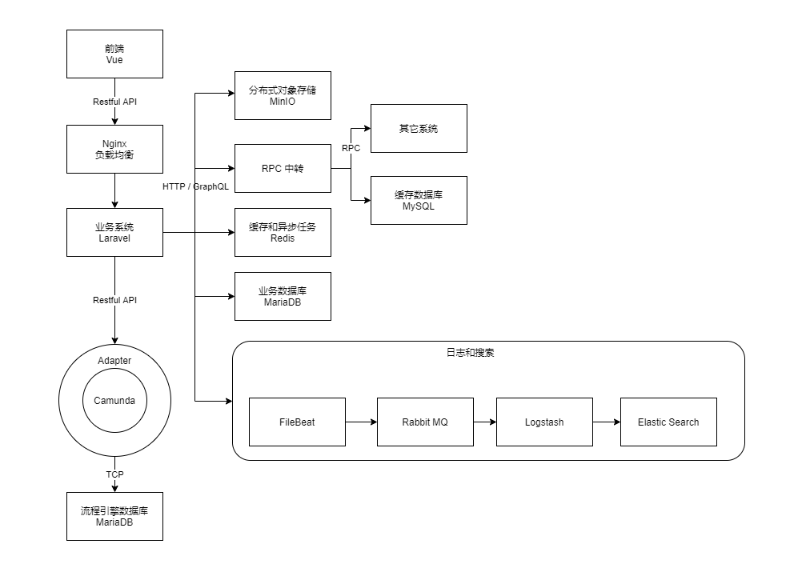
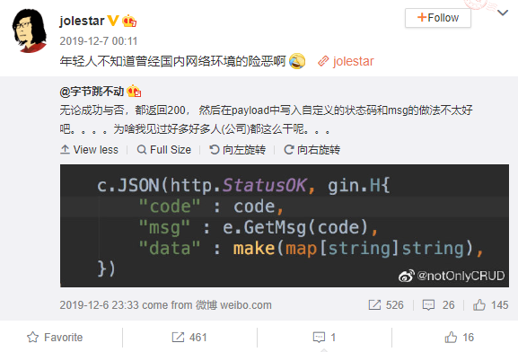

# 工作的第二和第三年（201807~202007）


2019 年 7 月本来想写 201807~201907 的部分，但由于当时项目比较赶，就一拖再拖。另外由于想写得详细一些，需要搜集很多信息，导致一直没进展。以下是 201807~202005 这段时间的内容，主要使用 PHP + MySQL。包含了接口设计、日志收集、分布式存储、高可用等内容。

## 18 年后半年

这段时间仍然是以维护和开发旧系统为主。

<!-- more -->

比较可以一提的有：  

- 写了套简易的异步任务管理器（10月）  
  写这个是因为我们系统会发送一个异步任务给外部系统，他们在执行完后，并不会回调我们系统的 API 通知我们任务状态。所以我们每次都是在流程的节点里面轮询调用接口去获取结果。我想要把轮询检测的部分独立出来，转成任务完成后再变更流程实例的状态。  
  刚好也有个新需求是外部系统会用回调通知任务状态，所以就写了个支持。  
  我是用 crontab 完成定时查询状态，毕竟业务上可容忍一分钟的延迟，所以不需要太复杂的组件。  

- 引入 IoC 容器（11月）  
  原先创建一个类是直接 new 或者使用 get/set 注入，而在 11 月的时候我把 Laravel 的 Container 库引入进来。使用服务容器获取服务对象。主要是便于单元测试。  
  在了解了 IoC 容器后，我在部门做了一次分享。以发展的角度，从最基础的代码过渡到使用 IoC 容器的九个阶段，更深刻地理解 IoC 容器存在的原因以及使用场景。

- 优化了个冗长且经常改动的 if-else（11月）  
  这是一个根据多个条件判断选取哪些数据的 if-else，包含了很多个分支，并且直接嵌在某个业务代码里面，其他地方无法使用。  
  我把它抽取成一个函数。此外，利用类似于表驱动法的优化方式，让它到 Json 文件中读取所需要的数据。然后用 for 循环去依次匹配，匹配到的时候返回其对应的数据。  
  原先需求方提需求的时候，会发一个 Excel 过来，然后把变更点用特殊颜色标记。开发人员根据这些变化点修改代码，在发布到线上后才能生效。经过我的修改，需求方只需要直接到系统界面上上传 Excel 就能应用修改。  
  其实如果有前端的小伙伴，我觉得做成界面直接配置更好。  

18 年总体表现还不错，年会上领了个公司级别的优秀员工奖。现在看来，这玩意儿最大的用处就是奖金和放老家让我爸开心一阵了。就算面试的时候想通过这个来表示比其他人努力，也没什么用。

公司这会儿被阿里和腾讯折腾得很难受，所以就算拿了优秀员工奖，年终奖金也没多少。

## 19 年新系统

这一年挺关键的。以前就有离职的想法了，但因为有计划重构系统，所以我就留下来争取主导重构的机会。年初终于开始推动了。

从现在往回看，确实学到了很多东西。不过也因为参与人数少，没能多学一些。最初的时候只有一个同事每周花两天左右的时间做前端，其余的都由我负责。

说是重构，其实是重新做。新的系统大致是下面这个样子：



#### 接口设计

为了设计接口，专门去了解了一下 RESTful API。主要从以下几个方面：

1. 指南。比如：  
    - REST API Design Guide
        [https://github.com/NationalBankBelgium/REST-API-Design-Guide/wiki](https://github.com/NationalBankBelgium/REST-API-Design-Guide/wiki)
2. 博客。比如：  
    - steps toward the glory of REST  
        [https://martinfowler.com/articles/richardsonMaturityModel.html](https://martinfowler.com/articles/richardsonMaturityModel.html)
    - 跟着 Github 学习 Restful HTTP API 设计  
        [https://cizixs.com/2016/12/12/restful-api-design-guide/](https://cizixs.com/2016/12/12/restful-api-design-guide/)  
    - RESTful API 设计最佳实践  
        [https://www.oschina.net/translate/best-practices-for-a-pragmatic-restful-api](https://www.oschina.net/translate/best-practices-for-a-pragmatic-restful-api)
3. API 文档。比如：  
    - GitHub API v3  
        [https://developer.github.com/v3/](https://developer.github.com/v3/)  
4. API：  
    - GitHub RESTful  
        [https://api.github.com/](https://api.github.com/)
5. RFC 标准：  
    - [https://tools.ietf.org/html/rfc7230](https://tools.ietf.org/html/rfc7230)
    - [https://tools.ietf.org/html/rfc7231](https://tools.ietf.org/html/rfc7231)

了解完之后，给我的感觉是 RESTful 的内容大多数都是按照 RFC 标准来的，在此基础上强调两点：

1. URL 尽量都用名词
2. 超媒体（Hypermedia）

有一次我在公司内部的 Wiki 上试图搜索一些 RESTful 内容，结果发现有一篇文章标题写着 RESTful，内容确是让人不要使用 DELETE/PATCH/PUT 这些方法。并且自己设计了一套 code 和 data 的格式，所有返回的 http code 都是 200。这不就是以前那种古老的设计方法嘛。如果说 Wiki 上那篇文章和 RESTful 有一丁点关系的地方，大概就只有 URL 尽量都用名词这一条了吧。这样看连 RESTful like 的层次都没达到。

超媒体这一条，我本来打算实现，但后面想想也没多大必要。内部系统给自己用的，做到 RESTful like 就差不多了。

而对于 RESTful like 来说，URL 尽量都用名词这一条我感觉是最考验接口设计者的。不仅要对业务非常熟悉，而且要能够把概念抽象出来。毕竟有时候一个操作涉及的东西特别多，普通的命名会导致 URL 地址太长。

还有一些要统一的，比如：

- 时间使用 ISO 8601 或者更准确的 RFC 3339 标准。  
    [http://www.rfcreader.com/#rfc3339](http://www.rfcreader.com/#rfc3339)
- 翻页的链接放在 Header 的 Link 中。  
    [http://www.rfcreader.com/#rfc8288](http://www.rfcreader.com/#rfc8288)

RFC 标准是把数据放 Body，把其他的往请求头放。毕竟这些信息也占不了多少空间。

花了挺多精力在 Restful 上面。不过我发现研究这些的用处并不大，毕竟在国内也不会有多少项目会去参考 RFC 标准来设计。大多数项目都是参考国内的通用设计，在此之上自己搞出一套标准出来。就算如此，也没有一套靠谱的标准，所以还是得根据项目所处环境调整。除非换到一个一开始就参考 Restful 的要求来实现接口的公司或团队。

以前刷微博时，看到一条吐槽无论成功与否，都返回 200 状态码的 API：



上图那个链接点进去是：


不过难道就真的只因为这个原因吗？我觉得更多的人是不知道有 RFC HTTP 标准的存在。如果不是 RESTful 流行起来，估计会更少有人知道这些标准的存在。而知道标准存在的那部分有决定权的人，愿意去了解，愿意去应用到新项目的，就更少了。

#### 接口文档

有了接口，总也得写接口文档吧？怎么写接口文档也是个问题。

最开始是写到内部的 WiKi 上，但是写起来不太方便。每个 API 都得写一个页面。

尝试了 Swagger，语法比较多，一开始吃力。感觉如果真用 Swagger，可能会被打，就放弃了。

最后还是写到 WiKi 上，不方便就不方便吧，也没啥。

我们系统是前后端分离，前后端并行开发的时候，前端需要获取接口的 Mock 数据。

我本来想用公司内部自己搞的一套 Mock 系统，但是发现太难用了。

后来自己搭了一套 Easy Mock，还可以从 Swagger 导入。但是 Easy Mock 有个毛病，就是它假设你是使用国内自己搞的那套接口标准，无论正确错误都返回 200 那种，上面吐槽过了。你要按照 RESTful 来做接口，它 Mock 起来返回的状态码或者数据就不会按你定义的来。无奈之下我去找到相关逻辑的代码，把它们改成我想要的样子。但这样也不是个办法。

最后干脆不要了。前端自己 Mock 去吧。

#### GraphQL

在研究 RESTful API 怎么设计而去 GitHub 参考它的文档时，发现了 GitHub 的新版 API 使用的是 GraphQL。

这让我很感兴趣，为啥 GitHub 要从 RESTful 转向 GraphQL？于是就各种找资料了解 GraphQL 是啥？解决了啥问题？

这一了解下去，突然兴奋。这不就正是能解决我们当前查询上的问题吗？

这个问题出在公司的 CMDB 和集群架构平台的接口太弱，以至于要查一些数据的时候，得调用一大堆 API。例如多对多关联的情况下，需要调用三个接口，就像是执行三条 SQL 语句，特别恶心。之前我们这边的应对办法是，定期获取所有接口的全量数据，放到 MySQL 数据库，然后从数据库里面用 join 查。

但是这对开发人员来说很不友好。当然有一部分原因是旧项目没有 ORM。如果有的话，就不会这么难了。由于没有 ORM，导致每个查询都需要写纯 SQL。而且之前的同事又一直没有复用的概念，基本上每次要查询都重新写一个 SQL，最多是把以前写的 SQL 语句复制过来，然后稍微改改。于是一大堆的表，要经过很长一段时间才知道各表之间的关联关系。

GraphQL 可以先定义好各表之间的关系，然后使用 HTTP 把想要的数据及其关联的数据一起拿到。由于它自带 API 文档，可以在一个名为 playground 界面中查看所有 API 及从某个字段找到关联的其他表的字段。

我把 GraphQL 引入重构项目，后来也在分享会上给部门的小伙伴介绍。

使用过后的感受可以说是好坏都有。好的一点是查询比较灵活，而且不会获取多余的字段。坏处是有时候获取的字段的数据会有重复，GraphQL 的基础库没有提供这种支持。另外 GraphQL 由于每个数据的每个字段都要执行一次 `resolve()` 函数，量一大就会消耗很多资源。也有一些其他的优缺点。但我发现好多介绍 GraphQL 的文章，都不喜欢谈它的缺点。

不过虽然引入了 GraphQL，我还是用它去查数据库里面的数据，而不是用来封装对 CMDB 接口的调用。但是使用 GraphQL 就为以后将查询切换为接口提供了方便。这是按字段 `resolve()` 所带来的灵活性。

#### 流程引擎

之前写过《[流程引擎为什么选 Camunda](https://www.cnblogs.com/schaepher/p/12571944.html)》和《[Camunda 流程引擎的一种 Adapter 层实现](https://www.cnblogs.com/schaepher/p/12735619.html)》。最开始设计系统的时候，大概花了一个月的时间把 Camunda 了解了一遍，然后根据 Camunda 已有接口组合出我们业务需要的样子。查了很多文档（特别是官方文档）和做了 N 多实验，有时候为了解决一个问题，干到凌晨两三点才下班。也算是体会了一把传说中的加班到十二点后。

#### Laravel

当时选它的原因估计是因为旁边有个大佬（目前在微信支付）用了很长时间的 Laravel，有一次在我们的每周分享上专门吹了一把 Laravel。另外也因为稍微尝试过 Yii2，感觉不太喜欢这种很固定 MVC 的方式。

很早就听说 Laravel 这框架很重，学起来很难。不过我当时在用的时候，没感觉到难在哪。虽然有那么一次出现问题，调试的时候在框架代码跳来跳去，不过这也没什么，而且只有一两次。之后越用越觉得好用，越觉得 Laravel 牛逼。

比较直接的是两点：

1. IoC 容器
2. 服务注册

作为一个菜鸡，当时也没啥经验。此处羡慕一下学 JAVA 的同学，天生就接触了这俩概念。

在接触 Laravel 之前，由于不知道这两者，让我走了不少弯路。

首先是 IoC 容器。用容器来获取对象非常灵活，而且对单元测试有很大的帮助。

以前我写过一篇单元测试的博客，主要是参考《单元测试的艺术》。我当时的说法是“如果要单元测试，首先要保证代码是可测试的”。而所谓的“可测试的”就表示需要使用依赖注入。当时其实也没理解清楚，依赖注入也只了解了常见的几种。后面找个时间重新写一篇关于单元测试的博客。

我上一篇《[入职一年啦](https://www.cnblogs.com/schaepher/p/9310352.html)》提到过重构一个基于 Zend Framework 框架写的项目。当时我还不知道有容器，所以大量使用 getter&setter 注入。

后来接触了 Laravel，然后专门有一次讲了 IoC 容器的由来。不过这由来是我自己推理来的。当时用的代码示例在：

[https://github.com/schaepher/DependencyInjection](https://github.com/schaepher/DependencyInjection)

我给定了九个阶段，然后发现自己在见到 Laravel 之前才处于第三阶段。靠自己的话，可能还要花上不少时间才能提到更高的阶段吧。再次羡慕 JAVA 同学，直接跳过摸索阶段，节约了好多时间。

另一个是服务注册。在接触它之前，我曾经为写 PHP 基础库的时候配置文件如何加载的问题而烦恼过。

这个基础库是为了将 PHP 调用转化为基于命令行的 RPC 调用。原本负责这个功能的代码全都放在一个文件里面，配置也固定在里面。我把它抽出来成为一个基础库。但是配置怎么加载就成了一个问题。

为什么呢？因为服务提供者有很多个组件，我得提供一个 Factory 类来创建不同服务提供者的对象，但是不想每次在创建的时候都在构造方法上设置配置文件，这会影响到调用方的体验。

最开始的做法是业务代码里面写一个类继承 Factory 类，然后在业务层实现 `loadConfig()` 方法，用于加载配置。后来接触到 Laravel 的服务注册，就学它的做法。在库里面写一个 Config 类，提供 `loadConfig()`，把配置加载到类的静态属性上。这样项目在加载的时候，入口处就可以把配置文件加载进去。后来甚至把它做成一个通用的服务加载器，还是参考 Laravel，定义一个包含 `register()` 和 `boot()` 方法的接口，让库去实现。

现在回想起来，当时自己想出用服务注册的方式也不会很难。思路到底卡在哪里了呢？我再琢磨琢磨。

总之就是 Laravel 用得越多，会觉得代码就该这么写，框架就该有这些功能。也难怪小伙伴经常说 Laravel 是最优雅的框架。

后续写一篇博客，讲讲 Laravel。虽然我现在转 Golang 了，但感觉 Laravel 还是挺有研究价值的。如果还有时间，那就再去跟 JAVA 的那套对比看看。

#### 日志 ELK 套餐

在真正用到项目中之前，也看过几篇写 ELK 使用的博客，但一直觉得很难。直到实践了才觉得如果只是简单地使用，实在是太简单了。如果要说那些博客让我看着怕怕的，感觉也挺过分。除非我能写出一篇令人满意的博客。后续试试看！

在实践 ELK 的过程中，还了解到了轻量级的日志收集工具 Filebeat。

关于日志，也是有不少可以讨论的。例如日志的轮转，日志文件的命名规则，日志内容的格式。

日志的量大，不可能只写在一个文件里面。用 Laravel 比较方便，可以配置每天写一个文件。日志的文件名会自动加上时间。我觉得这种方式挺好的。

因为有另外一种更常见但是也比较麻烦的日志文件命名方式。就是最近的一个文件名为 myapp.log，然后轮转时加上时间或者加上序号。举几个我在各种项目中见到的例子（以当前日期为例）：

|类型|示例|轮转时|
|:--|:--|:--|
|日期按月后置|myapp-202007.log |myapp-202007.log1 或者 myapp-202007-1.log|
|日期按月前置|202007-myapp.log |202007-myapp.log1 或者 202007-myapp-1.log|
|不要日期|myapp.log|myapp-20200713.log 或者 myapp.log.20200713|

还有一种比较特别的方式，就是创建的文件带日期，但程序实际写入的文件名不带日期。然后创建一个不带日期的软链接，指向带日期的文件。感受一下：

```
[hello@localhost test]$ ll
total 0
-rw-rw-r--. 1 hello hello  0 Jul 12 16:57 myapp-20200713.log
lrwxrwxrwx. 1 hello hello 18 Jul 12 16:57 myapp.log -> myapp-20200713.log
```

文件名会引起什么问题呢？这要看日志收集软件是怎么写的了。日志收集软件会记录当前追踪到哪个文件的哪个位置。

日志轮转的时候，会将当前文件名重命名，然后创建一个新的空文件。此时日志收集软件有两种方式：

1. 在 Linux 下，可以记录文件的 inode 及已读取的日志行的最新位置。（Filebeat）
2. 记录文件的名称及已读取的日志行的最新位置。（Rsyslog 待验证）

如果是第一种，那就没问题，毕竟重命名文件的时候不会变更 inode 号。但是第二种就麻烦了，会导致软件再次收集新文件名对应文件的内容，结果是 Elastic Search 里面有重复的日志记录。

除了文件名，还有个日志内容格式。这个就更多了，千奇百怪。

比如最基本的日志产生时间。至少有以下这么几种：  

- 28/Jun/2020:06:41:26 +0000
- 2020-07-13 01:10:00
- 2020-07-13T01:10:00
- 2020-07-13T01:10:00.52+08:00
- 2020-07-13T01:10:00+08:00
- 20200713011000
- UNIX 时间戳（不带毫秒）
- UNIX 时间戳（带毫秒）

有的在日期两旁用 `[]` 包起来，这里就不列出来了。

我个人喜欢 `2020-07-13T01:10:00.52+08:00` 这种，也就是 RFC 3339 里面的。兼顾了可读性和通用性。

至于日期后面的，最常见的是用 TAB 分割的内容。这些内容没有字段名，所以得到文档里面看它们分别代表什么。也有一些加字段名的，也是有很多种方式。

比如 `key0:value0||||key1:value1||||....`，和 `key0:value0 key1:value1` 。

我在这个项目里面使用的是把整条日志放 Json 里面，因为 Json 解析完直接丢到 ES，可以方便地做各个字段的查询。不过我后来发现这样也有问题。

日志变大是肯定的，因为每条日志都会多出字段名。另一个问题是 ES 文档每个字段在第一次出现的时候就固定其值的类型，如果后面新加入的日志中，某个个字段值的类型与原先不一样，就会报错。这样就得在写日志的代码里面多做一些工作。

从使用上来说，查询具体字段其实并没有用到。而且 ES 本身是支持全文索引的，所以不必要求日志用 Json。以后就直接丢一个文本给 ES，使用全文搜索就能满足大部分的日志查询需求了。

另外关于 Filebeat ，有件有意思的事情。我在后来尝试把 ELK 也引入到旧系统的时候，发现旧系统没法用 Filebeat。因为它要求 CentOS 版本要 6 以上。而我们旧系统是跑在 CentOS 5.8 的。我是想升级系统的，但是升级的风险很大，需要很多时间验证。后来我是用 rsyslog 让旧系统的日志发送到 RabbitMQ，才成功将旧系统的日志接入到 ELK。

由于旧系统的日志都保存在本机，系统部署在两台设备上，以前查日志还得跑不同系统上查询和聚合，因为同一个流程实例的每个节点可能由不同的服务器执行。查询的方式又是基于 grep，查询历史日志的时候巨慢，每次等得很痛苦。用上 ELK 套餐后，日志集中存储，有了索引查询起来飞快，而且日志按时间顺序排序了。

但是也有一个问题，旧系统记日志的时候，时间只记录到秒。而一秒内可以执行不止一个流程实例节点，就导致了在 Kibana 上查询日志按时间排序的时候，顺序会乱掉。这就是为啥日志时间最好带上毫秒。

#### 分布式文件存储

旧系统有好几台机器提供服务，用户上传的文件存储在其访问的机器上，这就导致要获取的时候比较麻烦。另外还有一个是登录远程机器执行命令的时候，如果不用我写的那个工具，而是用以前的写法，会导致保存结果的文件和消费这个文件的服务器不是同一台。

下面说说几种方案：

- 按需跨主机取   
   旧系统的做法是存储文件的时候，把文件名和所在机器信息存储到数据库里面。等需要获取的时候，查询数据库得到目标，然后从目标服务器传送过来。

- 通过 rsync 将文件同步到各台机器。  
    但是至少有三个问题：

    + 一个文件要传输 N - 1 次，给那台机器造成比较大的负担。当然也可以尝试专门一台机器作为同步中心。
    + 每台机器上都要存储一份拷贝，浪费硬盘空间。
    + 每次扩展一台机器都要全部拷贝一遍。

- NFS  
    + 存在单点故障问题
    + 需要自己做同步
    + 连接管理麻烦

- HDFS  
    + 不太适合用于存储小文件

- MinIO  
    - 虽然是对象存储，但存文件也没问题，而且轻量。
    - 自动同步。
    - 与 AWS S3 使用同一个协议 （S3） 协议。不过对于内部项目的好处不明显。主要是可以前期用 AWS，后期不用改代码就能切回自己搭建的 MinIO。

其他的没有去了解。MinIO 足够简单，而且够用。

#### Docker && Docker Swarm

18 年用了一段时间的 Docker，为老项目创建了 Docker 镜像，要搭建测试环境方便很多，但是没有用到生产环境上。

新项目则是一开始就使用 Docker 部署，生产环境上也是用 Docker。

为啥选 Docker Swarm 而不是 k8s 呢？因为 Docker Swarm 使用起来简单，k8s 比 Docker Swarm 维护起来麻烦多。毕竟很多人卡在了安装 k8s 这一步。总之对于小项目， Docker Swarm 就够用了。

我是挺想用 k8s 的，但我们这项目没有专业运维，我要是走了，留下一堆运维复杂的系统，怕是会被人天天骂。

负责一个完整的系统的时候，不得不考虑各种因素。感觉有点像打仗，有句话叫“外行谈武器，内行谈后勤”。一大堆牛逼的技术堆在一起，会提升系统的复杂度。所以通常都得做出妥协，选择够用的且对系统复杂度增加较少的方案。

#### 高可用

虽然集群内部有负载均衡，但如果只把域名解析到一台机器，到时候这台机器挂了就得修改域名解析。

关于高可用，以前了解的东西少，所以就只从域名解析入手。域名解析有两种方式：

1. 只解析到一台机器，当机器挂掉的时候，修改域名解析，解析到另一台正常的机器。
2. 解析到所有可用的机器，当一台机器挂掉的时候，把这台机器对应的解析去除掉。

这俩方案都有一个问题，就是域名解析是会有缓存的。用户使用域名访问后，其解析结果会缓存在系统里面，过一段时间才会失效。所以这会导致用户在域名解析过期之前无法访问。

后来接触并对 CDN 了解得比较多之后，知道了有 Virtual IP + keepalive 这种组合。

这种方式的特点是两台提供服务的机器上除了有属于自己的 IP 外，还有第三个 IP。这第三个 IP 称为虚 IP，（Virtual IP，简称 VIP）。

VIP 会绑定到两台服务器的其中一台，两台服务器都会装上 keepalive，然后将域名解析到 VIP 上面。当 VIP 所在机器挂掉后，正常机器的 keepalive 会检测到对方的机器挂掉了，并让他自己这台机器挂载这个 VIP，接着通过 VRRP 协议让上一层路由器知道 IP 和 MAC 地址的绑定关系发生了变更。这样当新的请求过来后，路由器会将请求转发到正常机器。

keepalive 通常不设置开机启动。这是因为当故障的机器重启后，机器上的应用可能是数据库，需要先同步数据。或者一些应用启动需要初始化，也需要等待。等待机器的状态修复为能正常提供服务时才启动 keepalive。

这个方案只需要配置一次，而且切换的速度极快。

不过切换速度快也会出现一些问题。例如检测故障的条件是一定时间没有受到心跳包，可能是因为网络拥塞或者机器的 CPU 高，会被误认为出现故障而执行切换。如果是双主单活数据库，在极端条件下会出现自增 ID 冲突的问题。如果想要解决这个问题，就得使用分布式 ID 生成。
