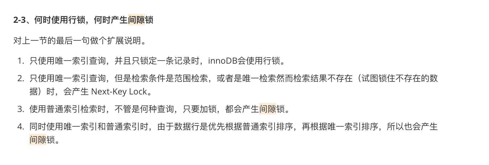
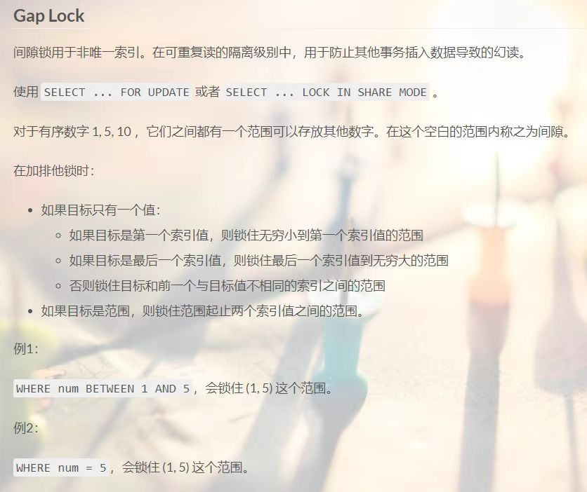
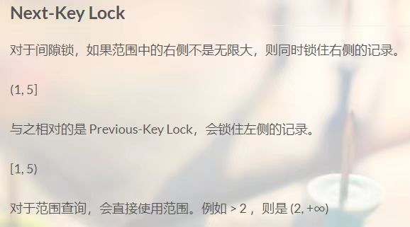

# 间隙锁

legend:  

legend:  
间歇锁

legend:  
锁什么

Schaepher:  
忘了

Schaepher:  
以前碰到过极端情况下间隙锁的死锁问题

legend:  
一般的 insert，update不会

Schaepher:  
不对，连是我碰到的还是看到的都忘了

legend:  
除非你用 replace

Schaepher:  
哦对

Schaepher:  
就是 replace

legend:  
replace很操蛋

Schaepher:  

Schaepher:  

legend:  
你上午肯定是被这个锁住了

Schaepher:  
date 是非唯一索引，确实有可能。但是我删除的是去年 7 月的数据，按照锁的范围，应该是 (-∞, "2021-07-15")

legend:  
这个nextkey lock呢

Schaepher:  
next key 应该是 2021-08-15

legend:  
锁住了今天的数据

Schaepher:  
但今天的是 2022-02-15，应该不至于。除非索引

legend:  

文章：[为什么我只改一行的语句，锁这么多？](https://www.cnblogs.com/guixiangyyds/p/18414747)
