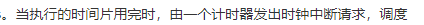
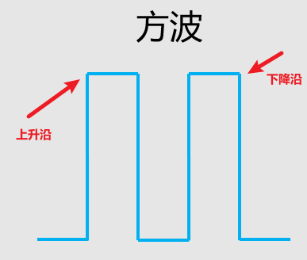

# CPU 中断

legend:  
假设只有一个CPU，CPU正在运行用户的程序，那么操作系统要如何夺回CPU使用权？

Schaepher:  
操作系统不是分配了时间片么，时间片运行完就返回给操作系统控制

legend:  
很明显

legend:  
不对

legend:  
注意审题

Schaepher:  
是想说更底层的，时间片的实现？

legend:  
你也知道时间片是操作系统分配的

legend:  
那当单cpu的时候

legend:  
操作系统怎么分配时间片

legend:  
差不多

legend:  
其实就2个字

Schaepher:  
中断呢

legend:  
我当时看到这个题完全没头绪

Schaepher:  
我有想到，但是在想中断怎么发

legend:  
这就扯到细节了

legend:  
什么中断触发

Schaepher:  
CPU 自己发的话，在什么阶段

legend:  
和cpu没关

legend:  
是有中断触发

Schaepher:  
另外的计时器来发？

legend:  
发哥应该知道时钟中断吧

Schaepher:  
忘了

legend:  
emmmmmm，我也忘了

Schaepher:  

Schaepher:  
CPU 自己发的那种，我是想到执行一条指令就中断一次。但是这样中断太频繁

legend:  
这个顺序应该是反了

legend:  
我的理解是时间片这个是由时钟中断触发

legend:  
而不是时间片到了

Schaepher:  
给时钟设置时间片长度，它计数到指定长度的时候，发出中断信号

legend:  
昂

Schaepher:  
我想起被上升沿和下降沿支配的恐惧了

legend:  
啥

legend:  
这个名词我有点熟悉，但是想不起来是啥

Schaepher:  
信号波形

Schaepher:  

legend:  
哦

legend:  
害，卷这些有啥用呢

legend:  
又用不到

legend:  
对吧

