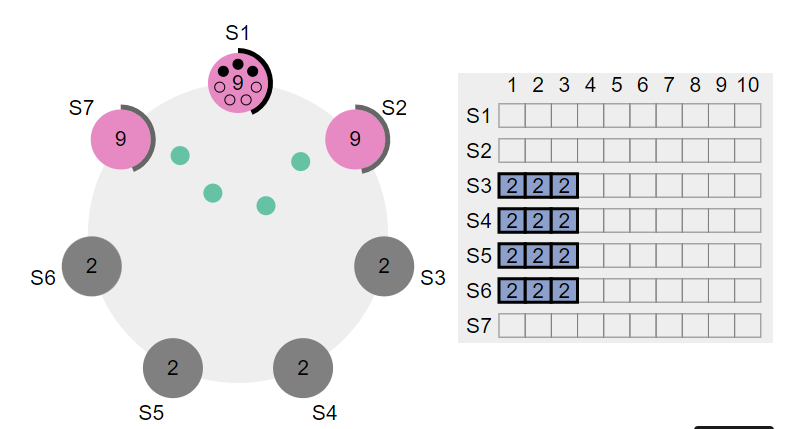
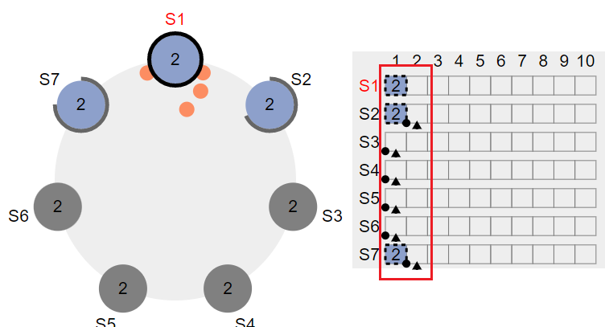
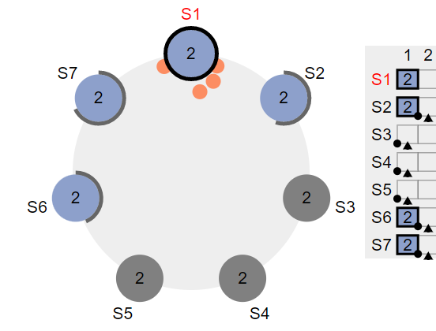

# 一致性

Schaepher:  
一致性分为哪两类

legend:  
母鸡。。。

legend:  
强一致？

Schaepher:  
强一致和最终一致

Schaepher:  
强一致性算法目前流行的是？

legend:  
raft？

Schaepher:  
啊对

legend:  
raft是啥一致性= =

Schaepher:  
raft 的 leader 选举过程呢

legend:  
不知道

Schaepher:  
哦不对，应该先问强一致性是如何保证的

legend:  
应该是每个点都拥有全量数据吧

Schaepher:  
不是=。=

legend:  
这个母鸡= 

Schaepher:  
让每个点有全量数据，最终一致性也可以

legend:  
也对

Schaepher:  
你这样说的话，那强一致性和最终一致性的区别是啥

Schaepher:  
问题绕回来了

Schaepher:  
步子跨太大

legend:  
那就是每次操作都需要大半节点确认？

Schaepher:  
退两步

legend:  
区别不就是每步确认以及阶段确认吗

Schaepher:  
我忘了

legend:  
你tm

legend:  
强一致性就是无论什么时刻去读取，任何节点数据都是一样的

legend:  
最终一致性是不保证上述条件，但是一定在某个时刻或者时间点需要一致

Schaepher:  
具体是如何保证的？比如我写了条新数据，但还没同步成功，这时候去读

legend:  
名称说不出

legend:  
但是说白了就是读写分离

legend:  
什么时候去更新读取的数据

legend:  
只有所有节点回复更新完成，才更新自己的读取数据

Schaepher:  
http://thesecretlivesofdata.com/raft/

legend:  
这不是回答这个问题的啊

Schaepher:  
反正我也不懂

legend:  
你tm

legend:  
你卷这个没用= =

legend:  
就是个选主过程

legend:  
问你一个问题，什么是网络割裂

Schaepher:  
分布式脑裂？

legend:  
嗯

legend:  
这个我不记得了

Schaepher:  
双 leader

legend:  
然后呢

Schaepher:  
我记得形成的原因是网络问题，在新主选完后，旧主恢复连接

Schaepher:  
和我说的不太一样

Schaepher:  
就刚刚给你的链接里面，也有这个示例

Schaepher:  
两个片区的节点断开，各自选一个 leader

Schaepher:  
看它举了个例子，用五个节点

Schaepher:  
分开后必定有一方没法获得半数以上的确认

Schaepher:  
那么必定有一方是更新失败的

Schaepher:  
只要连接后从更新成功的那一方同步日志就行

Schaepher:  
问题是如果用 7 个节点呢？

legend:  
那两个节点就一直hold？

Schaepher:  
嗯，直到连接成功后，舍弃掉

legend:  
肯定有合并的

legend:  
吧。。。。。

Schaepher:  
没找到答案

Schaepher:  
https://raft.github.io/
这个动画还行，可以交互

Schaepher:  
只是不能模拟脑裂的情况

legend:  
我记得是个版本号

legend:  
突然发现

legend:  
这个场景

Schaepher:  

Schaepher:  
只会有一个

Schaepher:  
我还学了一手，更新网页 js

Schaepher:  
把 5 个改成 7 个

legend:  
那不对啊

legend:  
他怎么知道该hold

Schaepher:  
就是一直处于 uncommit 状态

Schaepher:  

Schaepher:  
虚线表示没有提交

Schaepher:  

legend:  
没明白= =

Schaepher:  
未经大多数节点的确认，会一直保持在不提交事务的状态

legend:  
哦

legend:  
懂了

legend:  
你换个说法我就懂了

legend:  
语言的魅力

Schaepher:  
刚刚那个先卷完，脑裂还得有个条件

Schaepher:  
才能双 leader

legend:  
你不是说没法双leader？

Schaepher:  
就是原先的 leader 在少数节点一方

legend:  
不可能啊 == 

legend:  
不会出现leader在少数节点的情况啊

Schaepher:  
怎么就不可能了= =

Schaepher:  
网络又不会给 leader 开绿灯

legend:  
你leader是不是需要半数以上成员

legend:  
投票通过

Schaepher:  
对啊，关键它在断网前已经是 leader 了

Schaepher:  
不会因为断网了就改变它的状态

legend:  
哦

legend:  
你说这种情况

Schaepher:  
所以如果 leader 在多数方，就只会有一个 leader

Schaepher:  
然后还有一个概念，就是 region leader

legend:  
这个场景和你之前那个一样吧= =

legend:  
因为你少数方的leader没法同步他的写操作啊

legend:  
那这时候他不就被撸下来了

legend:  
双leader的时候，你发写操作是不是发哥两个

