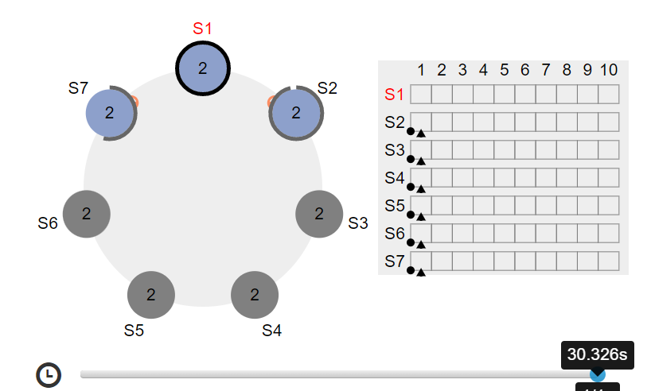
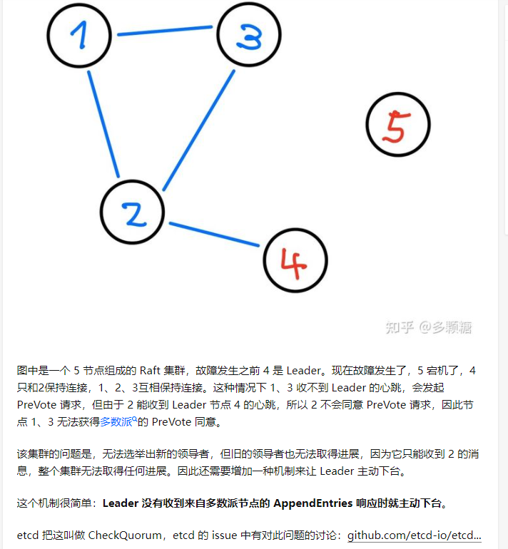

# Raft 原理

legend:  
双leader的时候，你发写操作是不是发两个

legend:  
然后一个是能同步半数以上

legend:  
一个不能

Schaepher:  
发一个

Schaepher:  
有可能发到少数方的

legend:  
但是这次写肯定是失败的

Schaepher:  
嗯

legend:  
然后这个leader就挂壁了

legend:  
对嘛

Schaepher:  
没挂壁，它还是 leader

legend:  
我没看你那个图，但是我靠猜的

legend:  
他应该不是了

legend:  
我记得有个自旋的机制

Schaepher:  
https://raft.github.io/

Schaepher:  
合并后不是

Schaepher:  
合并前是

legend:  
当多久没有超过半数的支持

legend:  
他就不是了

Schaepher:  
过了 20 秒还是

Schaepher:  

legend:  
那你说一下是怎么解决呢

Schaepher:  
解决啥

legend:  
不对

legend:  
我在网上看到的是，我说的那种方式呀 = =

legend:  
节点之间有个心跳，如果超过一段时间没有半数支持者，就会自己下台

Schaepher:  

legend:  

Schaepher:  
https://github.com/etcd-io/etcd/issues/3866

legend:  
我被你绕晕了。。。= =

legend:  
你说的是哪个问题

Schaepher:  
这个啊

Schaepher:  
就是你说的，leader 自己下台

legend:  
对啊，我不是回答你的那个问题吗

legend:  
这个

Schaepher:  
对啊，然后我详细了解了一下

legend:  
= = 

legend:  
尼玛

Schaepher:  
又不是说你的不对

legend:  
那你说的这个是啥

Schaepher:  
这个是网络分区的

Schaepher:  
每个分区的读写都要通过分区 leader

legend:  
哦，这个肯定的，因为每个节点并不一定拥有全量

Schaepher:  
分区leader 和 leader 不一定是同一个

legend:  
那么问题来了，他每次写只需要同步大半节点对吧

legend:  
那如果选举的时候

legend:  
选到了没有全量数据的节点咋办

Schaepher:  
选举的时候要看 event id 的大小

Schaepher:  
只会从最大的那些选 leader

Schaepher:  
要比较 (term, log index)

Schaepher:  
上面说的 event id 是 log index

Schaepher:  
我比较在意 log entry 是啥内容

legend:  
类似binlog？

legend:  
termId是啥来着

Schaepher:  
任期吧

Schaepher:  
例如第1届

Schaepher:  
第2届

