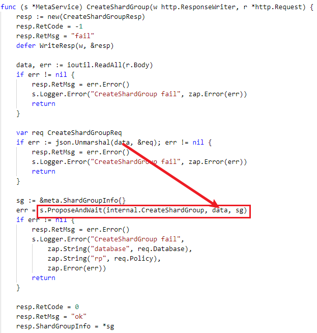
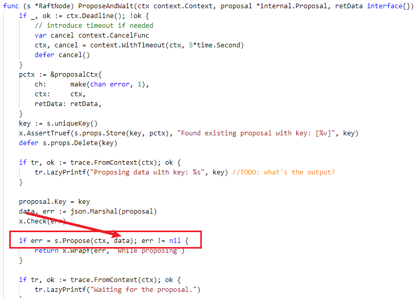
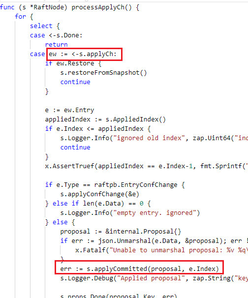
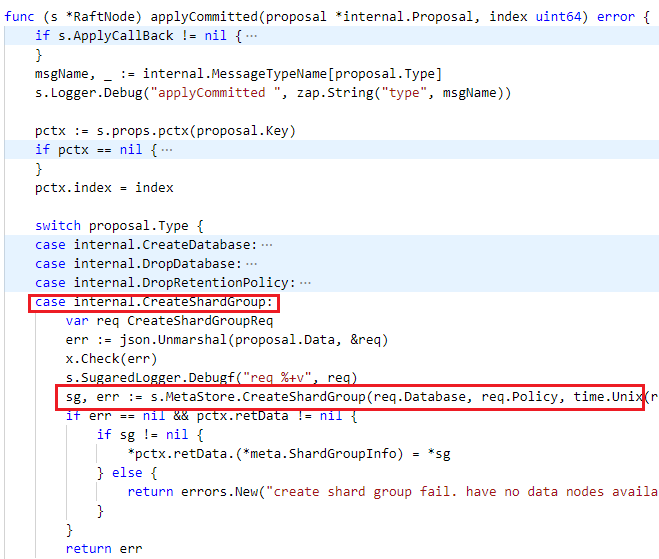

# InfluxDB raft 使用

Schaepher:  
我去瞄一眼 influx 的集群怎么用 raft

Schaepher:  
看了个大概

legend:  
开始你的表演

Schaepher:  
就一个新的操作，先 Propose，如果成功，就可以从 commited 里取出 Propose 的内容

Schaepher:  
内容可以是任意的

Schaepher:  
至于取出内容后怎么处理，就自己控制

legend:  
没明白= =

legend:  
你是说查还是？

Schaepher:  
增

Schaepher:  

Schaepher:  

Schaepher:  

Schaepher:  

Schaepher:  
图 2 到图 3 之间，是 raft 底层的一些操作

legend:  
感觉还是没get到我关心的点。。。。。。

Schaepher:  
因为还需要时间看

