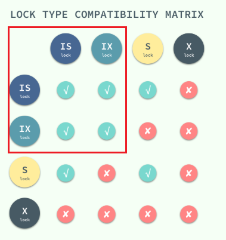
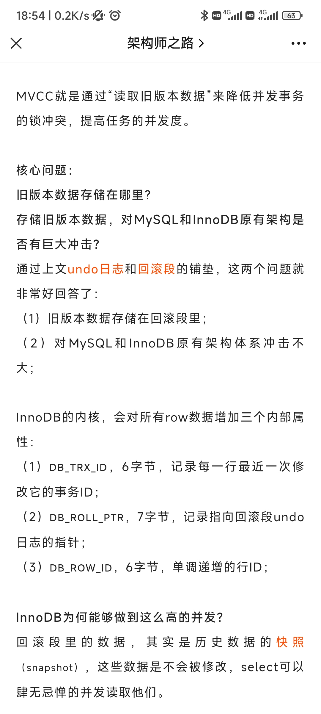
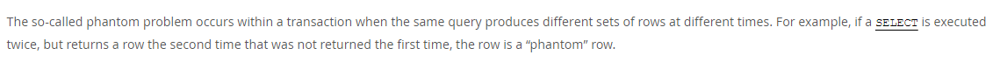
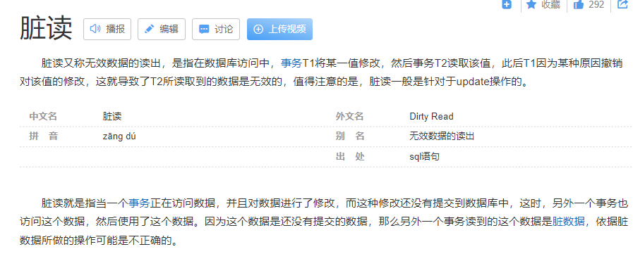
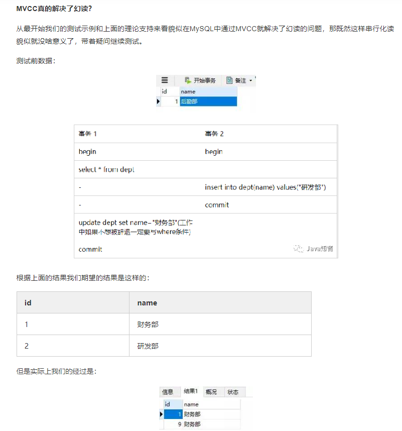

# MySQL MVCC

legend:  
mvcc开卷

legend:  
卷mvcc好像要理解好多东西。。。。。。。。。

legend:  
我刚看了篇文章

legend:  
直接把我干废了

Schaepher:  
让我也废一下

legend:  
他先从 锁开始

legend:  
悲观锁，2阶段锁，乐观锁，然后mvcc

Schaepher:  
easy

legend:  
carry me

Schaepher:  
你看的文章呢

Schaepher:  
吃独食？、

legend:  
https://draveness.me/database-concurrency-control/

Schaepher:  
好，首先第一个问题

legend:  
来

legend:  
comeon

Schaepher:  
意向锁用来解决什么问题？

legend:  
不知道

Schaepher:  
？

Schaepher:  
回去看你刚刚发的文章

legend:  
tmd哪有意向锁啊

Schaepher:  

legend:  
为了解决行在锁定的情况下被其他的事务修改

Schaepher:  
抽象了

Schaepher:  
不是行

Schaepher:  
看小标题

legend:  
为了父节点感知子节点锁的状态？

Schaepher:  
Yes

legend:  
但是我有点没明白

legend:  
意向锁不互斥对吧

Schaepher:  
当其他事务想要一个高粒度的锁的时候，就查看意向锁

legend:  
高粒度怎么判断

legend:  
那其实意向锁是一个状态？

Schaepher:  
嗯

Schaepher:  
高粒度看查询范围吧

legend:  
你的说法好像不对

legend:  
> 当其他事务想要一个高粒度的锁的时候，就查看意向锁

意向锁应该是与对应的锁互斥

Schaepher:  
意向锁之间不互斥

Schaepher:  

legend:  
你看清楚我的 == 

Schaepher:  
只是在加读写锁的时候，会根据意向锁来判断是否能加锁

legend:  
对

legend:  
所以和粒度没关

Schaepher:  
和粒度有关

Schaepher:  
意向锁是在锁住子节点的时候放到父节点的

legend:  
是的

Schaepher:  
当要给父节点加读写锁的时候，要做判断

Schaepher:  
所以肯定是现有分粒度的锁，才有意向锁的出现

Schaepher:  
没有分粒度的锁，就不需要意向锁

legend:  
对

legend:  
你这么说没错

legend:  
> 当其他事务想要一个高粒度的锁的时候，就查看意向锁
这个就不对

Schaepher:  
啊哈哈哈

legend:  
你tm老想忽悠我

legend:  
干你

legend:  
来，next one

Schaepher:  
这不是差不多意思嘛

legend:  
next one

Schaepher:  
没想好问题

Schaepher:  
这个问题一定要突出主要矛盾

legend:  
其实也不用，你看到啥问啥

Schaepher:  
第二个问题：
事务隔离级别中的可重复读，是如何借助 MVCC 实现的？

legend:  
问的好

legend:  
这个问题

legend:  
我觉得得先问

legend:  
假如没有mvcc

legend:  
会怎么样

legend:  
好了，我看完了

legend:  
来逼逼

Schaepher:  
来

legend:  
可重复读，事务开启的时候，就已经锁了读取的版本

legend:  
所以可重复度

legend:  
相当于每次读的都是副本

Schaepher:  
没有 mvcc，事务间读写同一个数据就可能会有冲突，需要通过行锁解决读写冲突。或者给行加版本号，用乐观锁。

Schaepher:  
> 可重复读，事务开启的时候，就已经锁了读取的版本

没有锁读取的版本

legend:  
有吧，不然你怎么重复读

Schaepher:  
每个数据行都有一个版本号

legend:  
对啊

Schaepher:  
事务版本号

legend:  
哦？

legend:  
哦

legend:  
随时间增长的

legend:  
版本号

Schaepher:  
否

legend:  
其实不用锁

legend:  
？？？？？？？？？

Schaepher:  
版本号是事务版本号

legend:  
我草。。。我理解错了

legend:  
我以为是每次写都是相当于加了个数据层

Schaepher:  
事务版本号如果是用唯一时间，那就是时间戳

legend:  
我是举个例子

Schaepher:  
如果是非时间戳的自增 id，那就是 ID

legend:  
就是一定是后面的比前面的打

legend:  
其实就是那个事务id

legend:  
tx_id

legend:  
还是叫啥来着

Schaepher:  
数据行的版本 id 取更新这个数据的事务 id，即 trx_id

legend:  
这句我没理解

Schaepher:  
当前事务在开启的时候，会创建一个结构体保存以下四个数据：

m_ids: 活动事务id列表（已经开始、尚未提交/回滚的事务）
min_trx_id: [m_ids]里最小的 id
max_trx_id: [m_ids]里最大的 id
creator_trx_id: 当前事务id

legend:  
尚未提交的id？

Schaepher:  
然后取数据行的时候，把数据行的 trx_id 和这些 id 作比较

Schaepher:  
https://www.zhihu.com/question/278643174?utm_source=wechat_session&utm_medium=social&s_r=0

Schaepher:  
说是未提交就写磁盘了

Schaepher:  
文章：[InnoDB并发如此高，原因竟然在这？](http://mp.weixin.qq.com/s?__biz=MjM5ODYxMDA5OQ==&mid=2651967047&idx=1&sn=b605fe50e6dd74ecad659c464a0e29ee&chksm=bd2d7b9b8a5af28d35c13e469e8e2c6a7082f00e608fd52d999fc0f7a6aec016faf2a8d748fa&mpshare=1&scene=1&srcid=0412hiYOZcP0HLJ7vJhJEK8R&sharer_sharetime=1649760836220&sharer_shareid=6112e3103f1b585f9dc8858ee983575c#rd)

Schaepher:  

Schaepher:  
旧数据在 undo log 回滚段里

Schaepher:  
这样问 mvcc 可以直接问：
采用 mvcc 的 mysql，其数据行的旧数据存在哪？

Schaepher:  
然后下一步，事务使用哪些字段确保读取正确的旧版本数据？

Schaepher:  
问题一：意向锁用来解决什么问题？

问题二：排它锁解决了什么问题？没有解决哪些问题？

问题三：共享锁解决了什么问题？没有解决哪些问题？

问题四：采用 MVCC 的 MuSQL ，旧版本的数据存储在哪？

问题五：采用 MVCC 的 MuSQL ，事务使用哪些信息确保读取正确的旧版本数据？

legend:  
> 说是未提交就写磁盘了

？

legend:  
我想想

legend:  
那回滚咋做

Schaepher:  
undo log

legend:  
我知道

legend:  
难道又要刷磁盘？

Schaepher:  
对啊

Schaepher:  
但是因为需要回滚的场景相对少，所以可以接受

legend:  
这个肯定有原因

Schaepher:  
哪个

Schaepher:  
直接写数据页刷盘的原因？

legend:  
嗯

Schaepher:  
减少内存占用

Schaepher:  
加快commit

Schaepher:  
第一点容易想到，第二点比较不容易

legend:  
这样嘛

legend:  
我觉得加快的这点不如磁盘消耗大

Schaepher:  
commit完直接生效，不需要等待

Schaepher:  
磁盘消耗只有在回滚的时候考虑

Schaepher:  
如果不回滚，那么就没有多余消耗

legend:  
哦

legend:  
我知道为啥了

legend:  
因为恢复

Schaepher:  
恢复？

legend:  
嗯

legend:  
你不写磁盘，咋恢复数据呢

Schaepher:  
你说的恢复，是指事务提交前还是提交后

legend:  
我想想

legend:  
如果未提交，他需要回滚

legend:  
其实好像没区别

Schaepher:  
嗯

Schaepher:  
提交后就是 redo log 了

legend:  
等会儿，读已提交应该也是使用mvcc的吧

Schaepher:  
是的

Schaepher:  
也是使用 mvcc

Schaepher:  
只是每次读的时候创建快照

Schaepher:  
重新获取 min max

legend:  
所以幻读的本质是什么

legend:  
这个也是常问的

Schaepher:  
幻读是事务执行期间，读取的数据发生数据行的增减导致的问题

Schaepher:  
行数无增减，只是值变化，为脏读

legend:  
不是吧= =

legend:  
首先脏读是在读已提交下

Schaepher:  

Schaepher:  
脏读的脏，是指值变化引起的脏。

legend:  
不

legend:  
绝对不是

Schaepher:  
那你说说

Schaepher:  

legend:  
最简单的一个问题

Schaepher:  
读未提交吧

legend:  
哦不好意思

legend:  
我记得错了= =

legend:  
不是

legend:  
不管是行还是值

legend:  
只要变化都会引起脏读啊

legend:  
那可能是我理解的和官方不一致吧。。。

legend:  
那我还是背官方的吧= =。。。

Schaepher:  
先解决这个问题：

1. 事务中第二次读取到的值与第一次读取到的值不一样，称为？
2. 事务中第二次读取到的行数比第一次多，称为？
3. 事务中第二次读取到的行数比第一次少，称为？

Schaepher:  
第三个分不出是哪个

Schaepher:  
得加上事务隔离级别

legend:  
> 先解决这个问题  
> 1. 事务中第二次读取到的值与第一次读取到的值不一样，称为？
> 2. 事务中第二次读取到的行数比第一次多，称为？
> 3. 事务中第二次读取到的行数比第一次少，称为？

1.脏读 （读未提交隔离级别）
2.不可重复读（读未提交或者读已提交）
3.不可重复读（读未提交或者读已提交）

legend:  
多和少是同一种情况吧？只是操作是新增或者删除

legend:  
这个我还真不清楚

Schaepher:  
1. 在读未提交的情况下，称为脏读。读已提交解决脏读问题。
2. 在可重复读的情况下，称为幻读。next-key lock 和 mvcc 解决了幻读的问题。
3. 在读已提交的情况下，没有特定称呼。

legend:  
emmmmmmmm

legend:  
我觉得你第二个不对呢。。。

legend:  
为啥

legend:  
第三个在读未提交的场景也会出现的

Schaepher:  
嗯，第三个在读未提交也出现

Schaepher:  
现在主要是第二个

legend:  
所以我们来battle第二个

Schaepher:  
你觉得哪里不对

legend:  
哦，等会儿

Schaepher:  
那是因为你是 MySQL 视角

legend:  
哦。。

legend:  
你说的不是mysql

legend:  
那这个问题就需要两种说法

legend:  
mysql以及广义

Schaepher:  
MySQL 的可重复读解决了读数据不出现幻读的问题

Schaepher:  
但是如果是写，就有可能写到其他事务新增的数据行

Schaepher:  
所以要在事务中显示加上 next-key lock

legend:  
我现在有个问题

legend:  
我觉得next-keylock没问题

legend:  
但是为啥mvcc没法解决幻读问题

legend:  
一下想不明白了

Schaepher:  
严格地说，mvcc解决幻读问题，没解决幻写问题

legend:  
没有幻写啊 = 

legend:  
只要我读不到，写不写有什么问题

Schaepher:  
比如一个 update，对全表执行

legend:  
嗯

legend:  
有什么问题

Schaepher:  
在执行前，其他事务插入一个数据

legend:  
我只要其他事物读不到

Schaepher:  
结果插入的数据被我更新了

legend:  
你要这么说的话

legend:  
我想想

Schaepher:  
legend:  
懂了

legend:  
等会儿

legend:  
你这个还是不丢

legend:  
对

Schaepher:  

legend:  
你写的时候是不是需要先查询一把？

legend:  
那查询的那个逻辑是当前度还是快照度

Schaepher:  
手动 select 是快照读

