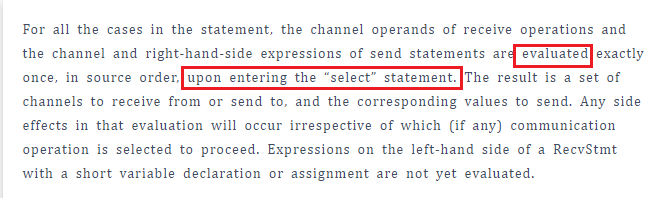

# Golang Select Deadlock

legend:  
文章：[一个select死锁问题](http://mp.weixin.qq.com/s?__biz=MzAxMTA4Njc0OQ==&mid=2651452655&idx=2&sn=46974a7126ab2d1c7610e8947f1a7906&chksm=80bb2a1db7cca30b0f901cd9cd4bef47e3f62b40af6f6d7f89e920baeccd045ec7c0f0018011&mpshare=1&scene=1&srcid=0418M8kqilSMaCfoL5ooGK8N&sharer_sharetime=1650247900715&sharer_shareid=c55e31868e6d7395e8262cf5c6f2b92f#rd)

legend:  
我咋感觉这个。。。和select没关呢

Schaepher:  
我觉得问题应该是：为什么要这么写。

legend:  
就是

Schaepher:  
是有工程上的好处，还是执行速度上的提升？

legend:  
最后那个题，我没想到啥原因

Schaepher:  
因为进入 select 之前都会执行一次。每次都会尝试从两个 input 中取出一个数据。然后进入 select 后，根据情况将其中一个丢给 ch

Schaepher:  

Schaepher:  
进入 select 时，确保每个 case 都是要么读 channel 要么写

legend:  
哦，懂了

Schaepher:  
不会出现读和写放在一个 case 里

legend:  
但是我下次肯定还会忘

Schaepher:  
忘了就忘了

Schaepher:  
谁 tm 这么写

