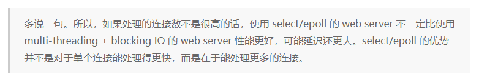
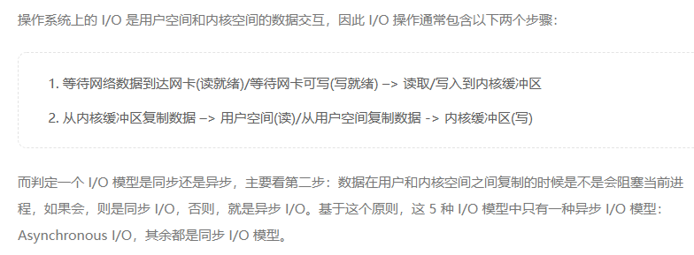
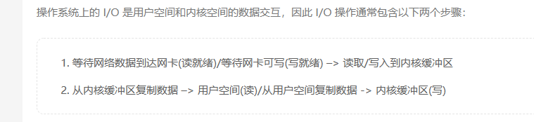
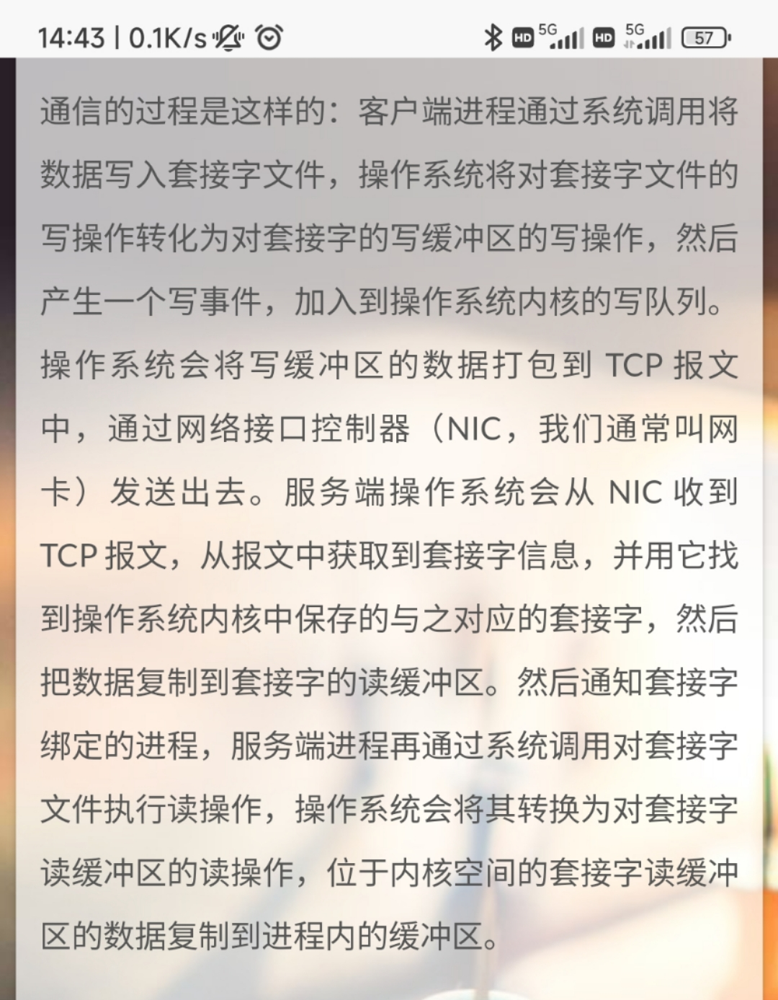
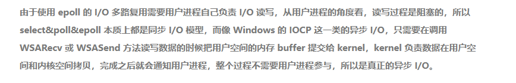
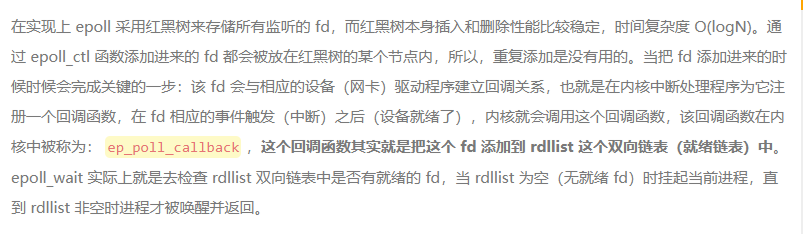

# 网络 I/O 多路复用

legend:  
io复用

legend:  
epoll，X哥不如先说说

Schaepher:  
i/o 复用是为了解决什么问题

legend:  
主要是复用线程，减少cpu等待

legend:  
吧

Schaepher:  
复用线程指的是怎么复用？

legend:  
这个复用说的是与原始的做法相比

legend:  
最简单的做法就是一个请求一个线程对吧

Schaepher:  
对

legend:  
那我如果就一个线程处理所有请求能不能做到呢

legend:  
我说的复用其实是这个意思

Schaepher:  
666

legend:  
所以，X哥来继续

Schaepher:  
还有一个，I/O 多路复用的场景

Schaepher:  
用在哪一个层次

legend:  
应用层

Schaepher:  
如果场景没搞清楚，会出现其他疑问

legend:  
吧

legend:  
你说的层次是啥意思

Schaepher:  
比如说，负责两个完全不同功能的模块， I/O 复用了。然后两个处理方式不一样，乱套了。

legend:  
哈？？？？

legend:  
还是没明白

Schaepher:  
没明白就对了

legend:  
io复用不是系统层的抽象吗= =

legend:  
和你这个有啥关系= =

Schaepher:  
就是说 I/O 复用是应用层使用的，应用层会在同一个功能模块里使用这个 I/O 复用。所以不会造成混乱。

legend:  
就算不同模块也可以啊= =

legend:  
对应的执行体不一样

legend:  
比如文件io和网络io

legend:  
底层都是文件句柄对吧

legend:  
中间层网络就多了个socket

legend:  
而且现在文件io没有io复用一说吧= =

Schaepher:  
所以说想到其他场景就会出现问题

legend:  
你的问题我还是没明白

legend:  
是我太菜了= 

Schaepher:  
不用明白，太菜了才会有那个问题

legend:  
所以继续卷= =

Schaepher:  
嗯。I/O 复用完整地说是 网络I/O复用

legend:  
嗯

legend:  
文件io的处理方式不一样

legend:  
面试常问的是

legend:  
select poll epoll的区别

legend:  
我每次问这个我就脑子痛

Schaepher:  
不同的处理方式嘛

Schaepher:  
就是一个认知成长的过程

legend:  
是，但是让我楞说= =

legend:  
我还真说不出

Schaepher:  
https://juejin.cn/post/6844903810322661390

Schaepher:  
按照一个方法论来整理：

1. 它解决了什么问题？
2. 它没有解决什么问题？
3. 它引入了什么问题？

Schaepher:  
select 解决了什么问题？

legend:  
好问题

legend:  
不知道

legend:  
select我一直没太明白

Schaepher:  
select 解决了一个线程只能处理一个请求的问题。

Schaepher:  
等等，这个问题还没完。

Schaepher:  
为什么要解决一个线程只能处理一个请求的问题？

legend:  
那你哪有那么多线程呢

Schaepher:  
没有就让请求失败咯

legend:  
那你能同时支持的并发数多少

Schaepher:  
不能用问题来回答问题

legend:  
> 那你能同时支持的并发数多少

那你的并发数就很低

Schaepher:  
你这个回答修改一下描述：因为一个线程处理一个请求，会限制最大的并发数量。

Schaepher:  
但线程切换的开销是主要问题

Schaepher:  
并发的数量受到什么限制？

legend:  
> 但线程切换的开销是主要问题

在这里还真不是。。。

legend:  
这里都不是切换的问题，是开启线程的开销就扛不住了

legend:  
内存不够

legend:  
> 并发的数量受到什么限制？

在什么情况下

Schaepher:  
这里漏了，应该是线程的创建和切换

Schaepher:  
我哪知道

Schaepher:  
你说说都有哪些勤快

Schaepher:  
情况

legend:  
这个范围太大了吧

Schaepher:  
那跳过

Schaepher:  
回到上一个问题

Schaepher:  
为什么要解决一个线程只能处理一个请求的问题？

legend:  
线程开销太大，成本恰不消

Schaepher:  
我觉得还得再往前了解一下，当初的前辈们为什么认为线程开销太大？
比如说，我们在看到服务器的各项资源被用满的时候，就觉得充分利用服务器了，然后可能就不做优化了。那么从当时的视角来看，请求数变多，服务器的资源用满了，为啥还要优化？
这个问题对于面试来说，没啥意义，纯粹是个人兴趣。

legend:  
那得看你能不能继续压榨啊

Schaepher:  
是不是他们发现了 cpu 很高，但 i/o 不高？

legend:  
iowait会很高

Schaepher:  
嗯，然后得出结论，没有充分利用最重要的 IO。而没有充分利用的原因是啥？分析后得出线程的创建、切换、资源竞争导致消耗了大量资源。

那么就得想办法解决这个问题。而这个问题的出现，是因为我们让一个线程绑定一个请求。

问题就转化为解决一个线程只能绑定一个请求的问题。

Schaepher:  
一个请求，说到底是对 socket 的读写。
最开始是线程的 i/o 固定绑定一个 socket。

legend:  
不是吧= 

legend:  
这个细节可能要看看

legend:  
我感觉不是

Schaepher:  
从哪个点开始不是？

legend:  
> 一个请求，说到底是对 socket 的读写。  
> 最开始是线程的 i/o 固定绑定一个 socket。

这个

legend:  
我说最原始的方法

legend:  
那时候没有socket吧

legend:  
我不确定哈

Schaepher:  
有啊

Schaepher:  
socket 是跟网络一起出现的

legend:  
哦

Schaepher:  
只是以前可能是创建一个 socket 后，临时创建一个线程去绑定这个 socket，然后处理。

Schaepher:  
然后把标准读绑定到 socket 读缓冲，把标准写绑定到 socket 写缓冲

legend:  
真的假的= =

Schaepher:  
看看 socket fd 是绑定到哪个 fd 号上的

Schaepher:  
> 然后把标准读绑定到 socket 读缓冲，把标准写绑定到 socket 写缓冲

这个是错的

legend:  
尼玛

Schaepher:  
应该是把 socket fd 作为参数传进去

legend:  
哦，对啊

legend:  
尼玛

legend:  
bind函数

legend:  
传的是socket fd和端口号

legend:  
尼玛

Schaepher:  
bind 个蛋蛋

legend:  
哈？？？？

legend:  
是吧

legend:  
尼玛

Schaepher:  
你串戏了

legend:  
我串了

legend:  
？

Schaepher:  
现在我们讨论的是 accept，你讨论个蛋蛋 bind

Schaepher:  
穿越达咩

legend:  
我串到 epoll了

legend:  
尼玛

Schaepher:  
分清楚 listen socket 和 socket 

Schaepher:  
以前我以为是同一个痛惜

Schaepher:  
东西

legend:  
哈？？？

legend:  
哦

legend:  
这个我也分不清

Schaepher:  
现在分清了就好

legend:  
还是没有

legend:  
我在想

Schaepher:  
？

Schaepher:  
listening socket 不处理具体的请求和响应的数据传输

Schaepher:  
仅用于建连

Schaepher:  
建完之后创建新的 socket，交给线程处理后续的读写

Schaepher:  
所以在多路复用出现之前，是每次直接创建线程或者进程，把 socket 传进去

Schaepher:  
现在则是各个线程找 select 、poll、 epoll 获取

legend:  
我消化一下

Schaepher:  
select 没有解决什么问题？

legend:  
select是啥

legend:  
先说一下

Schaepher:  
select 是监听一组 socket fd，当其中有 socket 被激活时，返回这个 fd 给应用处理。在未被激活前，线程阻塞。

legend:  
是几个线程监听

Schaepher:  
好多个

Schaepher:  
因为 select 用数组存储 fd，限制是 1024

Schaepher:  
数组大小为 1024

legend:  
> 好多个

好多个= =

Schaepher:  
select 没有解决的问题：
仍然需要创建很多个线程

Schaepher:  
select 引入了哪些问题？

legend:  
限制了大小

legend:  
啊哈哈哈或

Schaepher:  
限制了大小是属于没有解决的问题

Schaepher:  
select 没有解决的问题：
因为使用限制了大小的数组保存 socket fd，导致仍然需要创建很多个线程

Schaepher:  
select 引入的问题：
socket 数组需要完整从用户空间拷贝到内核空间，内核在遍历完数组后，需要把激活的 socket 组成新数组，再从内核空间拷贝到用户空间。这种数组的拷贝造成了系统资源的消耗。

legend:  
md。。。我理解起来好困难，是真的菜。。。你等我会儿

legend:  
我tm不理解为啥要这么设计啊= =

legend:  
这个模式好奇怪

Schaepher:  
为啥奇怪

Schaepher:  
我每个线程分配 1024 个 socket，然后每次把这些 socket fd 传给内核，让它帮我看看哪些 socket 被激活了

Schaepher:  
我就去逐个处理这些被激活的 socket

Schaepher:  
如果我不知道哪些被激活了，然后自己去读这些 socket，那么碰到没有被激活的 socket 就会被阻塞住。

legend:  
那激活是怎么返回用户态呢

Schaepher:  
写一个数组，复制过去

Schaepher:  
从内核态复制给用户态

legend:  
> 如果我不知道哪些被激活了，然后自己去读这些 socket，那么碰到没有被激活的 socket 就会被阻塞住。

哦，你这句话解开了我的疑惑

legend:  
X哥牛逼

legend:  
X哥强哇

Schaepher:  
或者如果使用非阻塞I/O，那么会返回错误，但是每次调用非阻塞I/O函数都得进入内核，造成浪费

legend:  
好了，我感觉可以进入下一个了

legend:  
poll

legend:  
等一下

legend:  
> 或者如果使用非阻塞I/O，那么会返回错误，但是每次调用非阻塞I/O函数都得进入内核，造成浪费

阻塞io和非阻塞io需要卷吗

Schaepher:  
好像也没啥，卷了花不了啥时间

legend:  

legend:  
这句话，说的好灵性

Schaepher:  
嗯，毕竟还要 socket 传给内核，然后遍历

Schaepher:  
多了一堆操作

legend:  
如果一个socket一个线程，需要传给内核啊，不过少一次就是了

legend:  
我理解没错吧

Schaepher:  
使用 select 的时候，要传一大堆 socket 给内核，数量上大

Schaepher:  
如果一个线程一个 socket，不需要选择过程

Schaepher:  
next

Schaepher:  
阻塞I/O、非阻塞I/O、同步I/O、异步I/O 的关系是什么？

legend:  
> 如果一个线程一个 socket，不需要选择过程

这里少了一次陷入内核

Schaepher:  
是的

legend:  
> 阻塞I/O、非阻塞I/O、同步I/O、异步I/O 的关系是什么？

问的好啊

Schaepher:  
1. 阻塞I/O、非阻塞I/O 的区别是什么？
2. 同步I/O、异步I/O 的区别是什么？
3. 阻塞I/O、非阻塞I/O、同步I/O、异步I/O 的关系是什么？

legend:  
我咋记得这个我们卷过

Schaepher:  
没有

legend:  
阻塞和非阻塞是用户态

legend:  
同步，异步是内核态

Schaepher:  
具体些

legend:  
在用户态阻塞就是阻塞io，不阻塞就是非阻塞

Schaepher:  
你搁这搁这呢

legend:  
同步是在内核态阻塞

legend:  
在用户态阻塞就是阻塞io，不阻塞就是非阻塞

Schaepher:  
你搁这搁这呢

legend:  
同步是在内核态阻塞

legend:  
异步就是内核态不则声

Schaepher:  
1. 阻塞I/O、非阻塞I/O 的区别是什么？
    用户态发起读取请求的时候，如果 I/O 没有数据，处理方式不同。一个是等待有数据，并且内核复制到用户态后才能继续执行；一个是立即返回错误。

2. 同步I/O、异步I/O 的区别是什么？
    区别在于当 I/O 有数据的时候，同步 I/O 的用户态在内核将数据复制到用户态的过程中阻塞。异步 I/O 的用户态在内核复制数据时不阻塞。

3. 阻塞 I/O 和非阻塞 I/O 都属于同步 I/O。

legend:  
好像你说的比较具体

legend:  
行吧

Schaepher:  
重要的是哪个行为在哪个过程的状态

Schaepher:  
阻塞和非阻塞的重要区别在于当读的时候没有数据的处理方式不同

legend:  
你说的对

Schaepher:  
同步和异步的重要区别在于当读的时候有数据的处理方式不同

Schaepher:  
特别是内核拷贝数据到用户态的这个行为的状态

Schaepher:  
next

Schaepher:  
poll 解决了什么问题？

legend:  
1024的问题

legend:  
把数组换成了链表

Schaepher:  
还有呢

legend:  
我就记得这个  = =

Schaepher:  
好像就这个

legend:  
啊，尼玛

Schaepher:  
不是，你说的是行为

legend:  
那应该怎们说呢

Schaepher:  
哦，就解决了这个问题

Schaepher:  
我想错了

Schaepher:  
poll 没有解决什么问题？

legend:  
还是需要把所有的fd拷贝一次

legend:  
所有的socket，不是fd

Schaepher:  
不是 socket，是 pollfd

Schaepher:  
pollfd 包含 fd、监听的事件、发生的事件

legend:  
这个得看看

legend:  
那select复制的是啥

legend:  
这么细我还真不知道

Schaepher:  
poll 没有解决什么问题？
1. 需要复制所有的 fd 到内核
2. 内核需要遍历所有 fd

Schaepher:  
int poll (struct pollfd *fds, size_t nfds , int timeout);

struct pollfd {
int fd;  /* 文件描述符 */
short events; /* 等待的事件 */
short revents; /* 实际发生了的事件 */
};

Schaepher:  
poll 引入了什么问题？

legend:  
这个事件不了解，后面卷一下，这个面试肯定不会问，但是我好奇

legend:  
没有吧= =，硬要说就是长度更长，遍历需要更久？

Schaepher:  
poll 好像没引入啥新问题。

legend:  
尼玛

legend:  
好家伙

legend:  
UNIX 网络编程

legend:  
这本X哥看过吗

legend:  

Schaepher:  
我买了这本书

Schaepher:  
是为了看一个关键的内容

Schaepher:  
但是发现没有写

Schaepher:  
哭了

legend:  

Schaepher:  
这个过程我之前好像有详细写过

Schaepher:  

legend:  
是啊

legend:  
我复习一下

Schaepher:  
> 是啊

是个啥，你看过？

legend:  
啊，你不是说我们之前总结的？

Schaepher:  
不是

legend:  
哦= =

legend:  
那就不是

Schaepher:  
https://schaepher.github.io/2020/07/02/tcp-socket/

Schaepher:  

Schaepher:  
找到了

legend:  
我现在有个问题

legend:  
就是当某个socket被内核写的时候，他是主动通知用户态来读，还是用户态需要轮训这个内存块

legend:  
这个select，epoll应该有区别

legend:  
但是我没找到相关资料

legend:  
难道是我绕进去了？

Schaepher:  
你绕进去了

Schaepher:  
这个不就是我们已经讨论过的吗

Schaepher:  
你没联系起来

legend:  
来，diss我

Schaepher:  
用户态只有 socket fd

Schaepher:  
socket 被内核写的时候，用户态不清楚。这个时候要看采用了哪种 I/O 方式。

legend:  
哦

legend:  
所以用户态要用fd去轮训，才知道哪个fd准备好了

legend:  
？

Schaepher:  
如果不使用 I/O 多路复用，那么线程执行 recv 读取。如果使用同步 I/O，就得等待内核把数据拷贝到用户态

Schaepher:  
ntm

legend:  
= =

legend:  
这里我就感觉有块空白= =

Schaepher:  
你昨天讨论了个鸡儿

Schaepher:  
今天全忘光

legend:  
昨天有讨论这个吗= =

legend:  
举个栗子

Schaepher:  
我们讨论多路复用的时候，如果是用 select 或者 poll，用户态要把它的 fd 列表给内核，内核把列表完整拷贝进去，然后由内核遍历

Schaepher:  
不是用户态用 fd 去轮询

legend:  
对啊

Schaepher:  
如果不使用多路复用，那么只有当使用非阻塞 I/O 的时候，才需要拿它自己的 fd 去轮询

legend:  
我这里说的fd，不是单个fd的意思

Schaepher:  
你这表达不完整

legend:  
select其实就是把单个变成列表轮训

Schaepher:  
用户态要把 fd 列表传递给内核去轮询，才知道哪个fd准备好了

legend:  
嗯

legend:  
epoll的优化就是不用列表传进去

legend:  
因为他是用户态维护了一个fd树

legend:  
没毛病啊

legend:  
你丫的

Schaepher:  
你丫的，你的表述的轮询这个动作的主语是用户态

legend:  
轮训这个动作是用户态啊

legend:  
他必须不停地拷贝去内核

legend:  
问，这些好了没

legend:  
你说的轮训是，内核态实际好了的返回的时候

Schaepher:  
你这个是一个好角度。问：调用 select 和 poll 的时候，如果所有 fd 都没有激活，那么会立即返回还是等待有激活的 fd 才返回？

Schaepher:  
从你的表述看，是立即返回

legend:  
立即吧= =，不然不就变成阻塞的了？

legend:  
epoll内核态怎么通知用户态准备就绪的fd

Schaepher:  
用户态调用 epoll 函数，epoll 把就绪 fd 的返回给用户态

legend:  
审题= =

Schaepher:  
epoll 调用回调函数？

legend:  

legend:  

Schaepher:  
用户态调用 epoll_wait

Schaepher:  
你问内核怎么通知用户态准备就绪的 fd，那是用户态调用 epoll_wait，然后挂起。内核会在 fd 准备就绪时激活用户态，把就绪的 fd 返回给用户态。

Schaepher:  
所以内核态是通过唤醒用户态进程来通知用户态准备就绪

