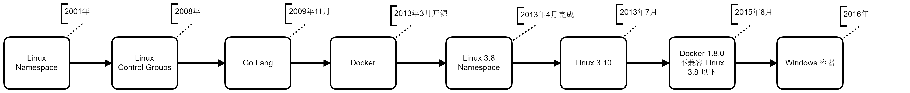

## 为什么以前没有 Docker 

在 Docker 安装文档的 CentOS 部分，要求最低要使用 CentOS 7。  
> 安装文档：  
> [https://docs.docker.com/install/linux/docker-ce/centos/](https://docs.docker.com/install/linux/docker-ce/centos/)

这是因为 CentOS 从 7 开始使用 Linux 3.10 以上版本的内核。从 Docker 的 FAQ 中可以看到对于 Linux 的要求：    
> Any distribution running version 3.10+ of the Linux kernel
> FAQ：  
> [https://docs.docker.com/engine/faq/#what-platforms-does-docker-run-on](https://docs.docker.com/engine/faq/#what-platforms-does-docker-run-on)

### Linux 3.10 有什么不同？

Docker 依赖 Linux 的两个内核特性：

- Namespaces：命名空间
- Control groups（cgroups）：控制组

而 Namespace 特性在 Linux 3.8 （2013年02月）才完成。  
> 文章：  
> [https://www.cnblogs.com/sammyliu/p/5878973.html](https://www.cnblogs.com/sammyliu/p/5878973.html)  
> Linux 内核版本发布时间表：  
> [https://kernelnewbies.org/LinuxVersions](https://kernelnewbies.org/LinuxVersions)



## 为什么 CentOS 6 可以装 Docker

CentOS 6 的内核是 2.6 但是也能装 Docker 1.8.0 之前的版本。这是因为 CentOS 会移植一些功能到旧内核。

但自从 Docker 1.8.0 开始就不再支持了。

为什么？可以见：[issue#14365](https://github.com/moby/moby/issues/14365)  

简单来说就是兼容性问题。新版 Docker 使用了新内核的特性。

## 为什么 Windows 10 可以直接装 Docker

Windows 10 引入了 Hyper-V 技术。  

[https://docs.microsoft.com/zh-cn/virtualization/hyper-v-on-windows/reference/hyper-v-architecture](https://docs.microsoft.com/zh-cn/virtualization/hyper-v-on-windows/reference/hyper-v-architecture)

## 为什么 Windos 7 可以装 Docker

实际上 Windows 7 本身是不支持虚拟化的。但是可以通过在 Windows 7 上安装虚拟机，然后在虚拟机里面安装 Docker。再使用 docker-machine 创建主机并关联到虚拟机。

https://docs.docker.com/toolbox/toolbox_install_windows/

## Docker 与 Go 语言

Go 编译的结果是一个单独的文件，这样的好处是我们可以基于一个非常小的基础镜像（如 Alpine），然后将编译后的文件复制进去。这样可以使得整个镜像非常小。

## 减小镜像大小，多阶段构建

在一个 Dockerfile 内部可以有多个 From xxx 用于构建多个镜像，这使得我们可以在前一个 From 编译，然后后一个 From 把编译的结果拷贝过来。

https://docs.docker.com/develop/develop-images/multistage-build/

例如：  

```
FROM ubuntu:latest as builder

RUN apt-get update
RUN apt-get install curl -y
RUN curl -L -o /tmp/go.sh https://install.direct/go.sh
RUN chmod +x /tmp/go.sh
RUN /tmp/go.sh

FROM alpine:latest

LABEL maintainer "Darian Raymond <admin@v2ray.com>"

COPY --from=builder /usr/bin/v2ray/v2ray /usr/bin/v2ray/
COPY --from=builder /usr/bin/v2ray/v2ctl /usr/bin/v2ray/
COPY --from=builder /usr/bin/v2ray/geoip.dat /usr/bin/v2ray/
COPY --from=builder /usr/bin/v2ray/geosite.dat /usr/bin/v2ray/
COPY config.json /etc/v2ray/config.json

RUN set -ex && \
    apk --no-cache add ca-certificates && \
    mkdir /var/log/v2ray/ &&\
    chmod +x /usr/bin/v2ray/v2ctl && \
    chmod +x /usr/bin/v2ray/v2ray

ENV PATH /usr/bin/v2ray:$PATH

CMD ["v2ray", "-config=/etc/v2ray/config.json"]
```

----------------------
