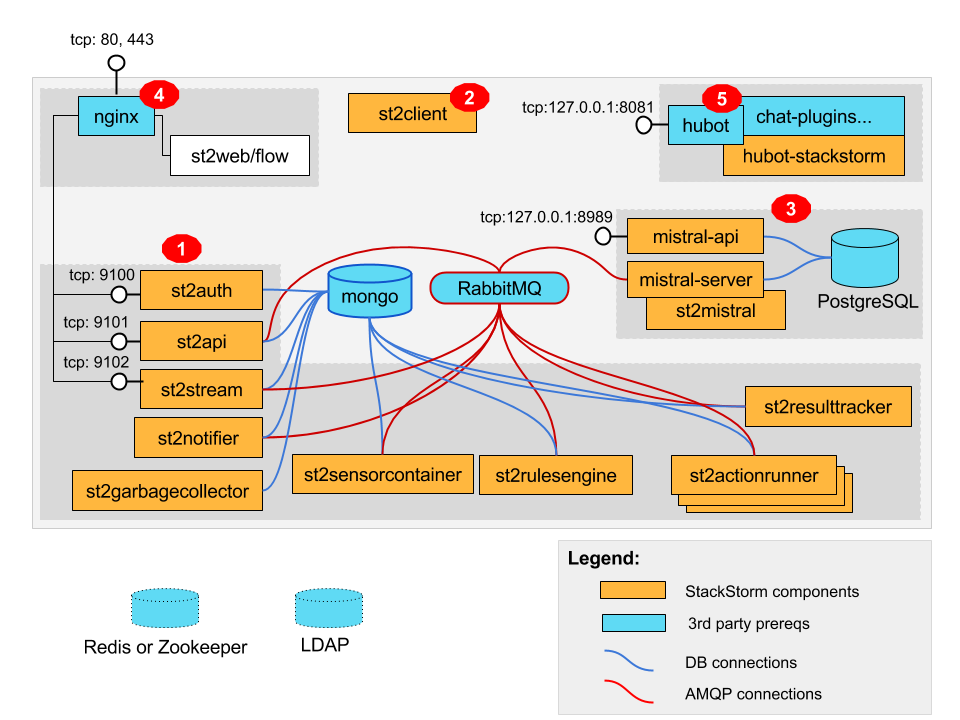

> 以下用 st 表示 Stackstorm。

可以到 st 官方网站查看 API 文档。  
> [https://api.stackstorm.com/](https://api.stackstorm.com/)

如果你已经学过命令行的使用，可以加上 `--debug` 参数来输出与命令等价的 curl 及输出。

st 默认用 Nginx 来处理 API 请求，默认端口为 9101 。API 的地址为：`https://$ST2_HOSTNAME/api`。

  
ref: https://docs.stackstorm.com/reference/ha.html

st 会默认生成自签名的证书。

