如果从先易后难的顺序介绍各种树，那么红黑树必然放在 AVL 树后面。但在红黑树之前，还有一种名为 2-3 树的平衡二叉树。2-3 树理解起来比红黑树容易很多，并且在理解它的基础上增加一个变更，就成了红黑树（尽管不是通常使用的那种红黑树）。因此学习红黑树的时候，最好先学习 2-3 树。

2-3 树与 AVL 树有一个不同的地方：AVL 树是从上到下增加树高，根节点只会因为旋转而改变；而 2-3 树是从下到上增加树高，节点值是从下往上挤，原先根节点容纳不下的时候，挤出一个新的根节点。

<!-- more -->

## 2-3 树

2-3 树与二叉树不同的是，它的节点除了可以有 2 个叉之外，还可以有 3 个叉。如下图：

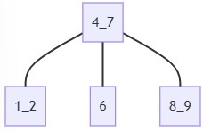

根节点的 4_7 表示该节点有两个值，分别是 4 和 7。为了方便讨论，把较小的值 4 称为低值，把较大的值 7 称为高值。

该节点有三颗子树，子树与节点的关系是：左子树所有节点的值都小于低值，右子树所有节点的值都大于高值，中间子树所有节点的值都介于高值和低值之间。

把这种有两个值且可以有 3 个叉的节点称为 3节点（例如值为 1_2 的节点），把只有一个值且最多只能有 2 个叉的节点（例如值为 6 的节点）称为 2节点。

### 新数据插入图示

由于有两种不同的节点，因此应该分情况讨论。

首先是最简单的 2 节点：


当插入值为 2 时，由于该节点还有一个空缺的位置，又没有子树，因此把值放入到节点内部。如下图：

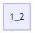

此时该节点成为一个 3节点。

接着，当继续插入值 3 的时候，发现这个节点无法容纳 3 这个值，只好把三个数的中间值 2 挤上去，两边的值作为子节点。

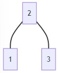

为了方便理解，有些资料会把值强行插进原先节点，变成一个 4节点，再把 4节点转换到上图的双层解构。下图是一个 4节点。

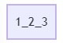

除了这种简单的根节点转换，还需要考虑到原先 3 节点有父节点的情况。例如最开始的图：


8_9 这个节点是一个 3节点，如果往树中插入 10 会发生什么？

8_9 节点无法容纳 10 这个值，需要把三个数 8_9_10 的中间数 9 往上挤。但 4_7 节点也无法容纳 9，因此需要再把 4_7_9 的中间数 7 往上挤。最终成为下图的样子：

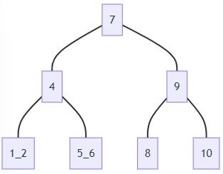

这样，2-3 树不需要有旋转的操作，只需不断地把中间数往上挤，就能保持平衡。

## 2-3 树的实现

根据上述过程的需要，可以写出以下结构：

```go
const (
	NODE_TYPE_2 = 2 // 2 节点
	NODE_TYPE_3 = 3 // 3 节点
)

type TreeNode struct {
	Type int // 表示节点类型：2节点、3节点

	LowValue  int
	HighValue int

	Parent *TreeNode
	Left   *TreeNode
	Middle *TreeNode
	Right  *TreeNode
}

// NewTreeNode 创建一个节点并设置为 2 节点
func NewTreeNode(value int) *TreeNode {
	return &TreeNode{Type: NODE_TYPE_2, LowValue: value}
}
```

根据合并算法的具体实现，结构体还会有不同的变化。例如有的实现中，不使用单独的 LowValue 和 HighValue，而是一个存储三个元素的数组 `Values [3]int`。先把子节点拆分时的中间数挤到父节点，再让父节点去调整。因为存储的时候节点变成了一个 4节点，所以结构体中还需要加入一个 `Tmp *TreeNode` 来存储子节点分离后多出来的一颗子树。

现在这个结构体，是我在 GitHub 上找到的一份 C 语言实现的 2-3 树代码翻译过来的。我认为这种实现容易理解，因此接下来会使用完整翻译后的代码做解析。

> C 实现的源代码在：  
> [https://github.com/Hazeman28/self-balancing-trees/blob/master/2_3tree/2_3tree.c](https://github.com/Hazeman28/self-balancing-trees/blob/master/2_3tree/2_3tree.c)

首先关注 Insert 时的行为。根据 2-3 树的特性，具体处理的时候应该考虑两点：

- 是否是叶子节点？
- 节点类型是 2节点还是 3节点？

最外层根据是否为叶子节点做不同的处理。

```go
func Insert(node *TreeNode, value int) *TreeNode {
	if node == nil {
		return NewTreeNode(value)
	}

	if node.IsLeaf() {
		return AddToLeaf(node, value)
	}

	// ... 非叶子节点的情况
}

// IsLeaf 判断是否为叶子节点。如果不是叶子节点，则 Left 必不为空。
func (node *TreeNode) IsLeaf() bool {
	return node.Left == nil
}
```

### 插入叶子节点

确定是否为叶子节点后，要考虑节点类型。2节点的情况比较容易，优先考虑 2 节点。

```go
// AddToLeaf 把新 value 添加到叶子节点
func AddToLeaf(node *TreeNode, newValue int) *TreeNode {
	if node.Type == NODE_TYPE_2 {
		if newValue > node.LowValue {
			node.HighValue = newValue
		} else {
			node.HighValue = node.LowValue
			node.LowValue = newValue
		}

		node.Type = NODE_TYPE_3

		return GetRoot(node)
	}

	// ... 3节点的情况
}

// GetRoot 获取 node 所在树的根节点
func GetRoot(node *TreeNode) *TreeNode {
	if node.Parent == nil {
		return node
	}

	return GetRoot(node.Parent)
}
```

2节点类型的叶子节点只需操作 Value。需要注意的点是，操作完必须把节点类型改为 3节点。

接着考虑插入时叶子节点为 3节点的情况。

3节点必然要拆成几个部分：

- 三数最小值单独为一个节点
- 三数中间值提升到父节点
- 三数最大值单独为一个节点

由于是叶子节点，不需要让单独出来的节点继承原先 3节点的 Left、Middle、Right，因此比较简单。

```go
func AddToLeaf(node *TreeNode, newValue int) *TreeNode {
	// ... 2节点的情况

	// 3节点的情况
	var left, right *TreeNode
	// 要提升到父节点的 value
	var promotedValue int
	if newValue < node.LowValue { // new_value < low_value < high_value
		left = NewTreeNode(newValue)
		promotedValue = node.LowValue
		right = NewTreeNode(node.HighValue)
	} else if newValue > node.HighValue { // low_value < high_value < new_value
		left = NewTreeNode(node.LowValue)
		promotedValue = node.HighValue
		right = NewTreeNode(newValue)
	} else { // low_value < new_value < high_value
		left = NewTreeNode(node.LowValue)
		promotedValue = newValue
		right = NewTreeNode(node.HighValue)
	}

	return MergeWithParent(node.Parent, left, right, promotedValue)
}
```

最后是将这三个部分合并到父节点。注意这里已经不再使用 node 这个节点了，它已经被拆成 3 个部分。

由于三个部分作为参数传入，它们也就不需要放到 node 里面。node 不需要额外添加属性去存储这些信息。

### 合并到父节点

当最初的拆分出现时，拆分的节点必然是根节点。因此先考虑根节点的情况。

```go
func MergeWithParent(parent, left, right *TreeNode, promotedValue int) *TreeNode {
	// 拆分的节点是根节点，因此再往上创建新的根节点。
	if parent == nil {
		parent = NewTreeNode(promotedValue)
		parent.Left = left
		parent.Right = right

		parent.Left.Parent = parent
		parent.Right.Parent = parent
		return parent
	}

	// ... 非根节点的情况
}
```

在这种情况下，promotedValue 必然是作为一个新的节点类型为2节点的根节点出现。

> 由于使用同样的解构存储2节点和3节点，因此需要确定2节点时的使用规则。3节点可以使用 Left\Middle\Right 三个属性，2节点只能使用两个。C 的实现中，2节点使用 Left 和 Middle 属性，不使用 Right。我认为使用 Right 会更贴近于 AVL 树，容易理解，因此 2节点不使用 Middle，而是使用 Right。

要特别注意的点是，必须让 left 和 right 的 Parent 指向新节点。由于 2-3 树是向上生长的，Parent 如果没设置好，会在升高的时候没法正确地把 Value 合并到父节点。

接着考虑非根节点的情况。由于节点特性，还需要分 2节点和 3节点的情况。

首先考虑比较简单的非根 2节点。与叶子节点不同的地方在于需要处理子树，其他没有区别。处理子树时，根据子节点提升的值和2节点已有值的大小比较，决定子树存放的位置。下图分别是左右两种情况。


```go
func MergeWithParent(parent, left, right *TreeNode, promotedValue int) *TreeNode {
	// ... 根节点的情况

	// 非根节点的情况
	if parent.Type == NODE_TYPE_2 {
		if promotedValue > parent.LowValue {
			parent.HighValue = promotedValue

			parent.Middle = left
			parent.Right = right
		} else {
			parent.HighValue = parent.LowValue
			parent.LowValue = promotedValue

			parent.Left = left
			parent.Middle = right
		}

		parent.Left.Parent = parent
		parent.Middle.Parent = parent
		parent.Right.Parent = parent

		parent.Type = NODE_TYPE_3
		return GetRoot(parent)
	}
	
	// ... parent.Type == NODE_TYPE_3
}
```

当然，仍然需要注意设置子节点的父节点。

最后考虑父节点是 3节点的情况。把提升的值的位置分为左中右三种情况讨论就行了。

- promoted_value < low_value < high_value
- low_value < promoted_value < high_value
- low_value < high_value < promoted_value


代码和插入到叶子节点不同的地方在于处理子节点。

```go
func MergeWithParent(parent, left, right *TreeNode, promotedValue int) *TreeNode {
	// ... 根节点的情况

	// 非根节点的情况
	// ... parent.Type == NODE_TYPE_2

	// parent.Type == NODE_TYPE_3
	var newLeft, newRight *TreeNode
	var newPromotedValue int
	if promotedValue < parent.LowValue { // promoted_value < low_value < high_value
		newLeft = NewTreeNode(promotedValue)
		newLeft.Left = left
		newLeft.Right = right

		newPromotedValue = parent.LowValue

		newRight = NewTreeNode(parent.HighValue)
		newRight.Left = parent.Middle
		newRight.Right = parent.Right
	} else if promotedValue > parent.HighValue { // low_value < high_value < promoted_value
		newLeft = NewTreeNode(parent.LowValue)
		newLeft.Left = parent.Left
		newLeft.Right = parent.Middle

		newPromotedValue = parent.HighValue

		newRight = NewTreeNode(promotedValue)
		newRight.Left = left
		newRight.Right = right
	} else { // low_value < promoted_value < high_value
		newLeft = NewTreeNode(parent.LowValue)
		newLeft.Left = parent.Left
		newLeft.Right = left

		newPromotedValue = promotedValue

		newRight = NewTreeNode(parent.HighValue)
		newRight.Left = right
		newRight.Right = parent.Right
	}

	newLeft.Left.Parent = newLeft
	newLeft.Right.Parent = newLeft
	newRight.Left.Parent = newRight
	newRight.Right.Parent = newRight

	return MergeWithParent(parent.Parent, newLeft, newRight, newPromotedValue)
}
```

需要再次提醒的是要给子节点设置父节点信息。

新值的插入就到这里了。由于使用了 MergeWithParent 的这种处理方式，使得代码无论是写起来还是理解起来都比较简单。

### 删除

如果没有做好总结，那么会发现删除时的情况特别多。不仅要考虑从删除的节点往下的节点，还要考虑其往上的节点。

由于 C 版本代码不包含删除操作，因此这里会先把删除操作总结后的内容写出来，然后再转换成代码实现。删除操作参考以下链接的说明：

> [https://www.geeksforgeeks.org/2-3-trees-search-and-insert/](https://www.geeksforgeeks.org/2-3-trees-search-and-insert/)  
> [https://www.cs.princeton.edu/~dpw/courses/cos326-12/ass/2-3-trees.pdf](https://www.cs.princeton.edu/~dpw/courses/cos326-12/ass/2-3-trees.pdf)

删除某个已存在节点时的操作有三条：

1. 如果删除的值不在叶子节点，则交换待删除值和它在树的中序遍历结果中的下一个节点值，然后删除；    
   需要注意的是，中序遍历结果中的下一个值必然在一个叶子节点上。
2. 如果一个值被删除后，所在节点值的个数为 0，就要从父母节点中取出一个值与兄弟合并
3. 如果一个值被取出后，所在节点值的个数为 0，就要从父母节点中取出一个值与兄弟合并，直到根节点为空时删除根节点。


以这张图为例。

删除 13 时，由于它在叶子节点，直接删除就完成了：


删除 9 时，由于它不在叶子节点，交换它和中序遍历下一个值 10 的位置：


然后删除 9：


删除 11 时，由于是叶子节点，直接删除：


11 之前所在的节点成为空节点。由于空节点在父节点的左子树，因此从父节点中取出低值，和空节点最近的兄弟 14 合并。


删除 16 时，由于是叶子节点，直接删除：


删除 17 时，由于是叶子节点，直接删除：


现在出现空节点了。空节点在父节点的右子树，如果父节点是3节点就要从父节点中取出高值，但这里父节点是2节点，因此取仅剩的一个值与 empty 节点的兄弟节点合并。

但兄弟节点 12_14 是一个3节点，所以合并的时候要把 12_14_15 的中间值挤上去：


删除 12 时，由于是叶子节点，直接删除：


原来的节点变成空节点。则让父节点的值合并到空节点的兄弟节点：


空节点仍然存在。由于空节点在中间子树，因此可以选择取父节点的低值然后与左兄弟合并，也可以取高值和右兄弟合并。这里取前者。

由于左兄弟 3_6 是3节点，合并时需要把 3_6_10 的中间值挤上父节点，接着由于这个节点变成了2节点，右子树 7_8 要转移到新节点上：


由于时间有限，代码留着以后再实现吧。

## 完整代码

```go
package main

import "fmt"

const (
	NODE_TYPE_2 = 2 // 2 节点
	NODE_TYPE_3 = 3 // 3 节点
)

type TreeNode struct {
	Type int // 表示节点类型：2节点、3节点。2节点时 Middle 必为空

	LowValue  int
	HighValue int

	Parent *TreeNode
	Left   *TreeNode
	Middle *TreeNode
	Right  *TreeNode
}

// NewTreeNode 创建一个节点并设置为 2 节点
func NewTreeNode(value int) *TreeNode {
	return &TreeNode{Type: NODE_TYPE_2, LowValue: value}
}

// IsLeaf 判断是否为叶子节点。如果不是叶子节点，则 Left 必不为空。
func (node *TreeNode) IsLeaf() bool {
	return node.Left == nil
}

// Text 获取节点 value 的字符串表示
func (node *TreeNode) Text() string {
	if node.Type == NODE_TYPE_2 {
		return fmt.Sprintf("%d", node.LowValue)
	}
	return fmt.Sprintf("%d_%d", node.LowValue, node.HighValue)
}

// GetRoot 获取 node 所在树的根节点
func GetRoot(node *TreeNode) *TreeNode {
	if node.Parent == nil {
		return node
	}

	return GetRoot(node.Parent)
}

// Insert 往树中添加一个 value。如果 value 已存在，则不做任何操作
func Insert(node *TreeNode, value int) *TreeNode {
	if node == nil {
		return NewTreeNode(value)
	}

	if node.IsLeaf() {
		return AddToLeaf(node, value)
	}

	if value < node.LowValue {
		return Insert(node.Left, value)
	}

	if node.Type == NODE_TYPE_2 && value > node.LowValue ||
		node.Type == NODE_TYPE_3 && value > node.HighValue {
		return Insert(node.Right, value)
	}

	if value == node.LowValue || value == node.HighValue {
		return GetRoot(node)
	}

	return Insert(node.Middle, value)
}

// AddToLeaf 把新 value 添加到叶子节点。如果添加前叶子节点已是 3 节点，则拆分并合并到父节点
func AddToLeaf(node *TreeNode, newValue int) *TreeNode {
	if node.Type == NODE_TYPE_2 {
		if newValue > node.LowValue {
			node.HighValue = newValue
		} else {
			node.HighValue = node.LowValue
			node.LowValue = newValue
		}

		node.Type = NODE_TYPE_3

		return GetRoot(node)
	}

	// node.Type == NODE_TYPE_3
	var left, right *TreeNode
	var promotedValue int
	if newValue < node.LowValue {
		left = NewTreeNode(newValue)
		promotedValue = node.LowValue
		right = NewTreeNode(node.HighValue)
	} else if newValue > node.HighValue {
		left = NewTreeNode(node.LowValue)
		promotedValue = node.HighValue
		right = NewTreeNode(newValue)
	} else {
		left = NewTreeNode(node.LowValue)
		promotedValue = newValue
		right = NewTreeNode(node.HighValue)
	}

	return MergeWithParent(node.Parent, left, right, promotedValue)
}

// MergeWithParent 把拆分后的左右子树和提升的 value 合并到父母节点。如果父母节点已经是 3 节点，则继续拆分往上合并。
func MergeWithParent(parent, left, right *TreeNode, promotedValue int) *TreeNode {
	// 拆分的节点是根节点，因此再往上创建新的根节点。
	if parent == nil {
		parent = NewTreeNode(promotedValue)
		parent.Left = left
		parent.Right = right

		parent.Left.Parent = parent
		parent.Right.Parent = parent
		return parent
	}

	if parent.Type == NODE_TYPE_2 {
		if promotedValue > parent.LowValue {
			parent.HighValue = promotedValue
			parent.Middle = left
			parent.Right = right
		} else {
			parent.HighValue = parent.LowValue
			parent.LowValue = promotedValue
			parent.Left = left
			parent.Middle = right
		}

		parent.Left.Parent = parent
		parent.Middle.Parent = parent
		parent.Right.Parent = parent

		parent.Type = NODE_TYPE_3
		return GetRoot(parent)
	}

	// parent.Type == NODE_TYPE_3
	var newLeft, newRight *TreeNode
	var newPromotedValue int
	if promotedValue < parent.LowValue { // promoted_value < low_value < high_value
		newLeft = NewTreeNode(promotedValue)
		newLeft.Left = left
		newLeft.Right = right

		newPromotedValue = parent.LowValue

		newRight = NewTreeNode(parent.HighValue)
		newRight.Left = parent.Middle
		newRight.Right = parent.Right
	} else if promotedValue > parent.HighValue { // low_value < high_value < promoted_value
		newLeft = NewTreeNode(parent.LowValue)
		newLeft.Left = parent.Left
		newLeft.Right = parent.Middle

		newPromotedValue = parent.HighValue

		newRight = NewTreeNode(promotedValue)
		newRight.Left = left
		newRight.Right = right
	} else { // low_value < promoted_value < high_value
		newLeft = NewTreeNode(parent.LowValue)
		newLeft.Left = parent.Left
		newLeft.Right = left

		newPromotedValue = promotedValue

		newRight = NewTreeNode(parent.HighValue)
		newRight.Left = right
		newRight.Right = parent.Right
	}

	newLeft.Left.Parent = newLeft
	newLeft.Right.Parent = newLeft
	newRight.Left.Parent = newRight
	newRight.Right.Parent = newRight

	return MergeWithParent(parent.Parent, newLeft, newRight, newPromotedValue)
}

// Search 搜索 value
func Search(node *TreeNode, value int) *TreeNode {
	if node == nil {
		return nil
	}

	if node.Type == NODE_TYPE_2 {
		if value < node.LowValue {
			return Search(node.Left, value)
		}
		if value > node.LowValue {
			return Search(node.Right, value)
		}
		if value == node.LowValue {
			return node
		}

		return nil
	}

	if value < node.LowValue {
		return Search(node.Left, value)
	}
	if value > node.HighValue {
		return Search(node.Right, value)
	}
	if value == node.LowValue || value == node.HighValue {
		return node
	}

	return Search(node.Middle, value)
}
```

## 2-3 树与红黑树的关系

2-3 树理解起来并不复杂，使用这种方式实现也比较简单。从 2-3 树可以看出一个规律：任意节点到叶子节点的所有路径的长度相同。

有没有一点红黑树的味道？如果把 3节点的 LowValue 和 Left、Middle 下放，并且把 LowValue 标记为红色，原先节点标记为黑色，是不是就得到满足红黑树性质要求的树了？


区别是，红黑树所说的是“从一个节点到一个 NULL 指针的每一条路径必须包含相同数目的黑色节点”。对于 2-3 树来说也是如此。

但是如果对比 2-3 树转换的红黑树与我们通常看到的红黑树，会发现两者不一样。例如在如下红黑树展示网站插入 1、2、3 这三个节点的时候：

> [https://www.cs.usfca.edu/~galles/visualization/RedBlack.html](https://www.cs.usfca.edu/~galles/visualization/RedBlack.html)

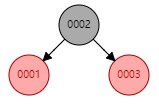

得到的是两个红色子节点。如果是使用 2-3 树的转换，应该三个节点都是黑色的：


实际使用的红黑树是 2-3-4 树所对应的红黑树。

前面 2-3 树规定 3 节点只能用低值作为红色节点，对应的红黑树是一颗左倾红黑树（LLRB，Left-leaning red-black trees）。左倾指的是连接到红色子节点的线是往左的。

- 为什么不直接用 2-3 树或者 2-3-4-树？
- 为什么不使用 2-3 树转换的红黑树，而是使用 2-3-4 树的？

数据解构专题的下一篇会继续展开。
